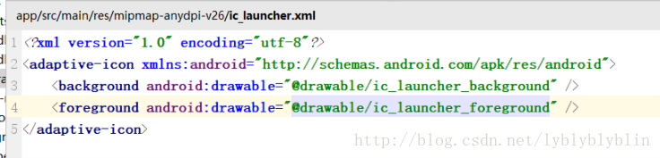

# 关于drawable和drawable-v24


# 关于drawable和drawable-v24

今天调试一个软件，老是找不到资源

```xml
android.content.res.Resources$NotFoundException: Resource
```


断点调试可以看到是有的，当然项目的目录里面也有该资源，
最后找到原因是我将图片资源放到drawable-v24里面，导致7.0以下不能找到图片
不同的drawable文件夹用于为设备兼容性和不同的Android版本提供不同的屏幕密度。

断点调试可以看到是有的，当然项目的目录里面也有该资源，
最后找到原因是我将图片资源放到drawable-v24里面，导致7.0以下不能找到图片
不同的drawable文件夹用于为设备兼容性和不同的Android版本提供不同的屏幕密度。

7.0的关于图片资源的改变
从Android API 24（安卓7.0）开始，自定义Drawables类可以最终在XML中使用（仅在您的包中）。


8.0的关于图片资源的改变

API 26（安卓8.0）中添加了VectorDrawable自适应图标




[更多解释](https://developer.android.com/guide/practices/ui_guidelines/icon_design_adaptive.html)
