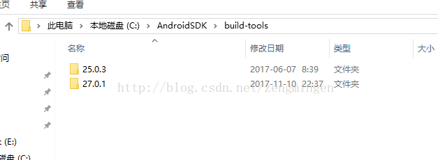
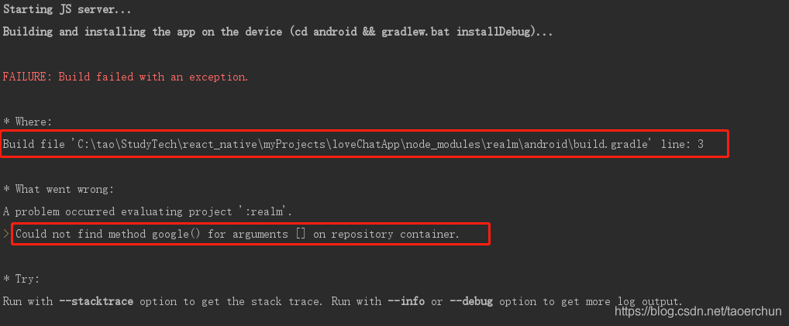
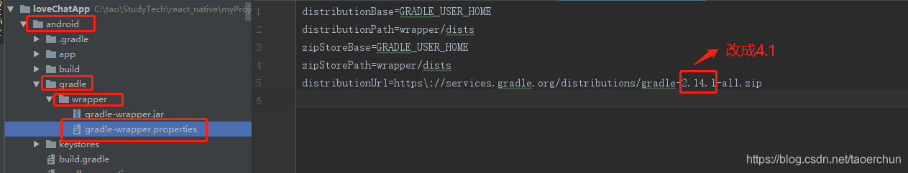
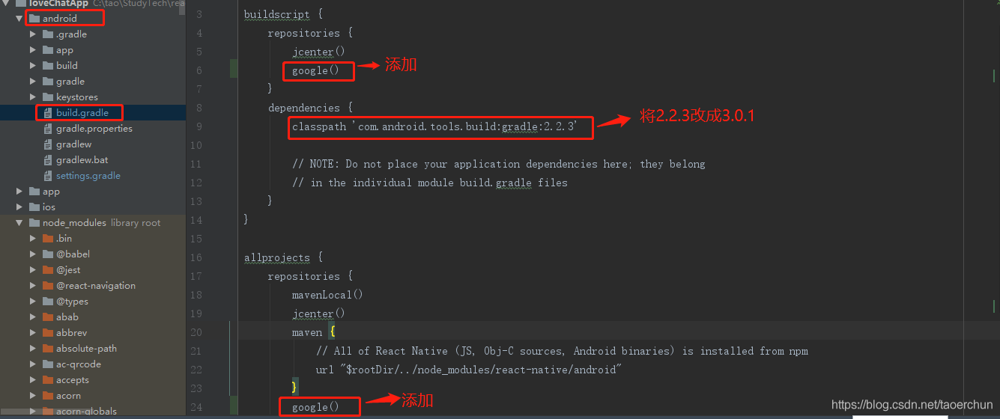
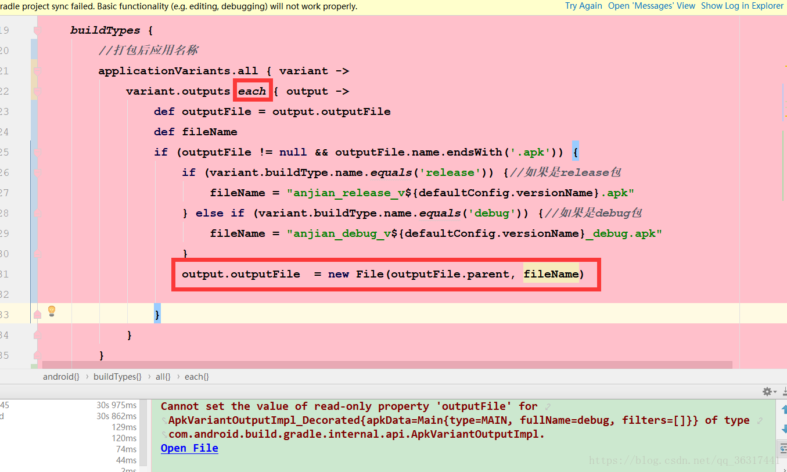
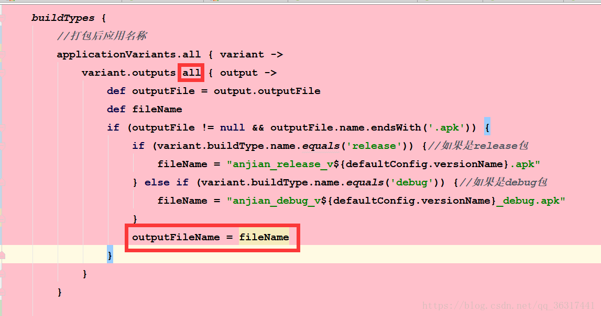
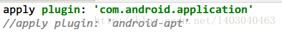
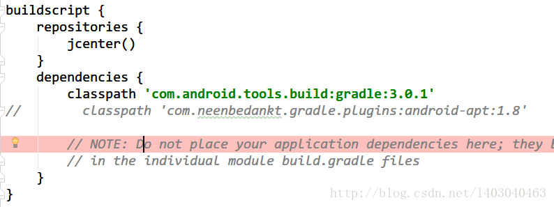

# Android-版本更替不兼容修正


# Android-版本更替不兼容修正

## CardView、RecyclerView在buildTools28->30用法改变

Android开发 CardView卡片视图、RecyclerView回收视图

> 注意开发工具从28变为30以后即src目录下的bulid.grade文件中的buildTools版本改变
>
> ```json
> android {
>     compileSdkVersion 28
> 	buildToolsVersion "28.0.0"
> }
> ```
>
> ```json
> android {
>     compileSdkVersion 30
> 	buildToolsVersion "30.0.3"
> }
> ```
>
> CardView、RecyclerView都发生了使用变化

引用：

> app目录下的bulid.grade文件中依赖dependencies改变
>
> 只要将implementation 'com.android.support:cardview-v7:28.0.0’换成implementation 'androidx.cardview:cardview’就行了（recyclerview类似改变）；
> 原因：版本28（面向android pie及以下版本）是遗留支持库的最后一个版本，因此我们建议您在使用android q并继续前进时迁移到androidx库。IDE可以帮助您：重构>迁移到AndroidX…，
>
> ```json
> dependencies {
>     implementation 'com.android.support:cardview-v7:28.0.0'
> 	implementation 'com.android.support:recyclerview-v7:28.0.0'
> }
> ```
>
> ```json
> dependencies {
>     implementation "androidx.cardview:cardview:1.0.0"
>     implementation "androidx.recyclerview:recyclerview:1.1.0"
>     // For control over item selection of both touch and mouse driven selection
>     implementation "androidx.recyclerview:recyclerview-selection:1.1.0"
> }
> ```
>
> 依赖请看官方文档[Cardview](https://developer.android.google.cn/jetpack/androidx/releases/cardview?hl=zh_cn)、[RecyclerView](https://developer.android.google.cn/guide/topics/ui/layout/recyclerview#java) 

XML文件

主要是CardView、RecyclerView的标题

原来CardView

```xml
<android.support.v7.widget.CardView
    xmlns:android="http://schemas.android.com/apk/res/android"
    xmlns:app="http://schemas.android.com/apk/res-auto"
    android:layout_width="match_parent"
    android:layout_height="wrap_content"
    android:layout_marginLeft="5dp"
    android:layout_marginRight="5dp"
    android:layout_marginTop="5dp"
    android:elevation="5dp"
    app:cardCornerRadius="5dp">
</android.support.v7.widget.CardView>
```

RecyclerView

```xml
    <android.support.v7.widget.RecyclerView
        android:id="@+id/recyclerView"
        android:layout_width="match_parent"
        android:layout_height="match_parent">

    </android.support.v7.widget.RecyclerView>
```

变为CardView‘

```xml
<androidx.constraintlayout.widget.ConstraintLayout 
    xmlns:android="http://schemas.android.com/apk/res/android"
    xmlns:app="http://schemas.android.com/apk/res-auto"
    xmlns:tools="http://schemas.android.com/tools"
    android:layout_width="match_parent"
    android:layout_height="match_parent"
    tools:context=".MainActivity">
    
    <androidx.cardview.widget.CardView
        android:id="@+id/card_view"
        android:layout_width="100dp"
        android:layout_height="100dp"
        app:layout_constraintTop_toTopOf="parent"
        app:layout_constraintBottom_toBottomOf="parent"
        app:layout_constraintLeft_toLeftOf="parent"
        app:layout_constraintRight_toRightOf="parent">
        
        <TextView
            android:id="@+id/content1"
            android:text="内容"
            android:gravity="center"
            android:layout_width="match_parent"
            android:layout_height="match_parent"/>

    </androidx.cardview.widget.CardView>
    
</androidx.constraintlayout.widget.ConstraintLayout>
```

RecyclerView'

```xml
<!--    你的可能是这样的-->
    <android.support.v7.widget.RecyclerView
<!--        这才是对的-->
    <androidx.recyclerview.widget.RecyclerView
<!--        xxx-->
<!--        xxx-->
    .../>
```

## Failed to find Build Tools revision 26.0.1

```shell
Error:A problem occurred configuring project ':app'.

\> Failed to find Build Tools revision 26.0.1
```

在build.gradle 中buildToolsVersion

如何修改。看本地安装了哪些版本的

进入文件夹Android SDK 目录下build-tools，修改为里面有的版本



## Could not find method google() for arguments [] on repository container.

问题：
在react native中安装realm数据库后运行react-native run-android 时报如下错：



开发环境：

react-native:^0.55.4

reaml:^2.27.0

解决方案：
1、打开项目根目录下android/gradle/wrapper/gradle-wrapper.properties

将distributionUrl=https\://services.gradle.org/distributions/gradle-2.14.1-all.zip中的2.14.1改成4.1



2、打开项目根目录下的android/build.gradle

1）、在buildscript和allprojects下的repositories分别添加google()

2）、将dependencies中的classpath 'com.android.tools.build:gradle:2.2.3'中的2.2.3【具体看自己的是多少】改成3.0.1



重新运行编译项目命令，要下载新的gradle，这个过程有点慢。至此，问题已解决！

## Could not find com.android.support:appcompat-v7:25.0.0

老的Android工程导入as报错如下：

```shell
10:36	Gradle sync failed: Could not find com.android.support:appcompat-v7:25.0.0.
			Required by:
			FuNongTong:app:unspecified (18 s 207 ms)
```


如果是gradle4.0及以下，增加maven { url "https://maven.google.com" }，如下：

```json
buildscript {
    repositories {
        jcenter()
        maven { url "https://maven.google.com" }
    }
    dependencies {
        classpath 'com.android.tools.build:gradle:2.2.3'
 
        // NOTE: Do not place your application dependencies here; they belong
        // in the individual module build.gradle files
    }
}
 
allprojects {
    repositories {
        jcenter()
        maven { url "https://maven.google.com" }
    }
}
```

如果是gradle4.0及以上，maven { url "https://maven.google.com" }替换为google()

如下：

```json
buildscript {
    repositories {
        jcenter()
        google()
    }
    
}
 
allprojects {
    repositories {
        jcenter()
        google()
    }
}
```

## 

## Cannot set the value of read-only property 'outputFile' for ApkVariantOutputImpl_Decorated{apkData=M

android studio升级到3.1.4之后gradle里的很多配置也相应发生了一些改变。在打包的时候我就遇到了这样的问题。

报错为：Cannot set the value of read-only property 'outputFile' for ApkVariantOutputImpl_Decorated{apkData=Main{type=MAIN, fullName=debug, filters=[]}} of type com.android.build.gradle.internal.api.ApkVariantOutputImpl.

截图如下：



大家可以注意看一下，AS升级到3.0以上版本后，截图上的红框处的代码都要改动，否则是无法正常打包的。那要改成什么样呢，如下图所示：



改成上图所示的样子就可以正常打包了，另外我也把代码贴出来方便大家复制。

```json
 //打包后应用名称
        applicationVariants.all { variant ->
            variant.outputs.all { output ->
                def outputFile = output.outputFile
                def fileName
                if (outputFile != null && outputFile.name.endsWith('.apk')) {
                    if (variant.buildType.name.equals('release')) {//如果是release包
                        fileName = "anjian_release_v${defaultConfig.versionName}.apk"
                    } else if (variant.buildType.name.equals('debug')) {//如果是debug包
                        fileName = "anjian_debug_v${defaultConfig.versionName}.apk"
                    }
                    outputFileName = fileName
                }
            }
        }
```

## build.grade.dependence随版本引用关键字改变

```json
//    testCompile->testImplementation
//    compile->implementation
//    provided->compileOnly
```

## Error:android-apt plugin is incompatible with the Android Gradle plugin. Please use 'annotationProce

AS从2.3.3升级到3.0后，项目没有任何改动就出现了这个错误，解决步骤如下：

一、把module/build.gradle下的apt插件应用全部注释掉



二、把dependencies下的apt全部改为annotationProcessor

> annotationProcessor 在as最新版本也失效，要如下操作
>
> annotationProcessor 'org.projectlombok:lombok:1.18.6' 修改为
>
> compile 'org.projectlombok:lombok:1.18.6' 即可


三、把project/build.gradle中的apt插件声明注释




## 更新Gradle项目时报错Gradle sync failed: Unsupported method: BaseConfig.getApplicationIdSuffix

查看Android Gradle 插件版本说明。
https://developer.android.google.cn/studio/releases/gradle-plugin.html#updating-plugin

修改对应的项目根目录下的build.gradle的依赖（dependencies）下的gradle的build工具版本

```json
dependencies {classpath "com.android.tools.build:gradle:4.1.3"}
```

和项目根目录下的gradle文件夹中的wrapper文件夹中的build.gradle文件中的gradle版本

```json
distributionUrl=https\://services.gradle.org/distributions/gradle-6.5-bin.zip
```

> 注意：第一个文件要在原来jcenter（）位置加上google（）	
>
> ```json
> repositories{ google()
>         	  jcenter()}
> 
> ```

##  Could not resolve all files for configuration ':app:debugRuntimeClasspath'.

   > Could not find com.android.support:appcompat-v7:23.2.1.
   > Searched in the following locations:

```
repositories {
        google()
        maven{ url 'https://maven.aliyun.com/nexus/content/groups/public/'}//加上这行
        //jcenter()
}
```


## end
