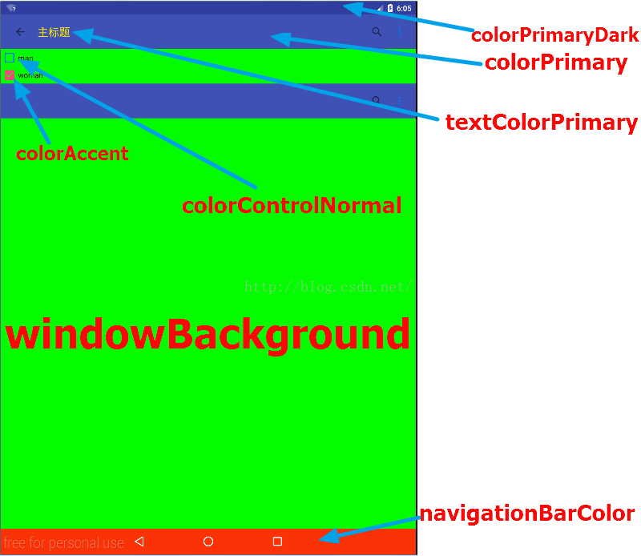
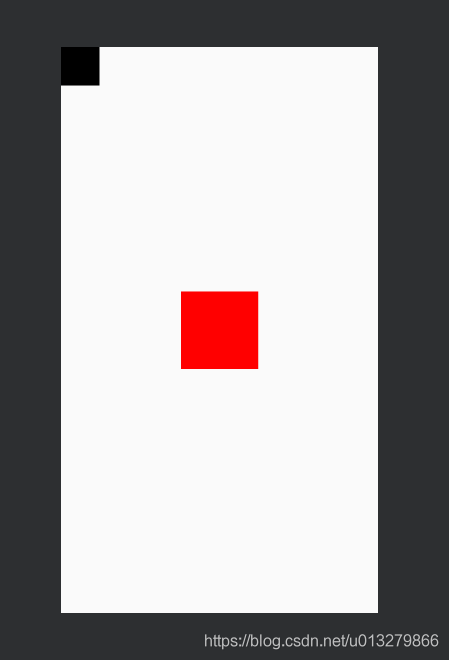
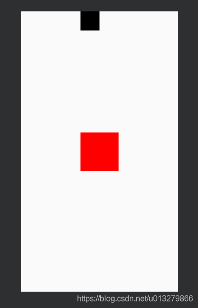
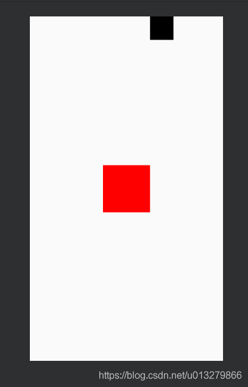
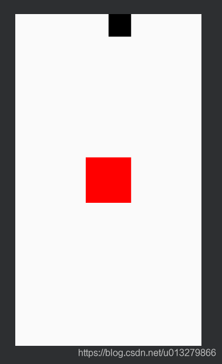
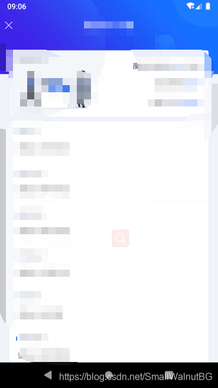
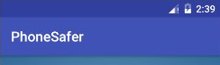
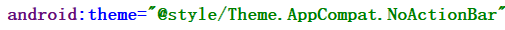

# Android开发笔记


# Android开发笔记

## Android5.0常用颜色属性说明

在使用Eclipse的时代，我们很少去在style文件给整个应用或者Activity去设定颜色，那是因为即使设置也不会提升用户的视觉效果。但是材料设计号称让没有设计功底的人也能做出漂亮的App，那我们今天就来看看在Androi5.0中常用的颜色属性。

我们可以先定义一个style，然后在这个style中设定每一个Activity或者整个App的颜色，最后在清单文件中来给某个Activity设置主题即可。代码如下：

```xml
<style name="AppTheme.NoActionBar">
    <!--状态栏颜色-->
    <item name="colorPrimaryDark">@color/colorPrimaryDark</item>
    <!--控制各个控件被选中时的颜色-->
    <item name="colorAccent">@color/colorAccent</item>
    <!--页面背景色-->
    <item name="android:windowBackground">@color/windowBackg</item>
    <!--底部导航栏颜色-->
    <item name="android:navigationBarColor">@color/navigationColor</item>
    <!--Appbar背景色-->
    <item name="android:colorPrimary">@color/colorPrimary</item>
    <!--ToolBar上的Title颜色-->
    <item name="android:textColorPrimary">@color/textColorPrimary</item>
    <!--各个控制控件的默认颜色-->
    <item name="android:colorControlNormal">@color/colorControlNormal</	item>
</style>
```

最后再来一张图详细说明每个item设定的到底是哪里的颜色：


## ConstraintLayout基本使用之toLeftOf 、toTopOf、toRightOf、toBottomOf

关于ConstraintLayout的博客、文章想必大家已经见过很多了，都是很全面的，今天这篇博客主要将ConstraintLayout的

```xml
layout_constraintLeft_toLeftOf
layout_constraintLeft_toRightOf
layout_constraintTop_toTopOf
...
```


以上到底怎么理解呢？下面我将通过图片+文字来解释。

现在假设屏幕中间有个长宽为100dp的红色正方形，屏幕左上方有个宽高为50dp的黑色正方形，如下:
接下来我们一个一个试试这些参数吧!

1、layout_constraintLeft_toLeftOf(可以看出黑色正方形左边和红色正方形左边对齐)




2、layout_constraintLeft_toRightOf(黑色正方形的左边和红色正方形的右边对齐)



3、layout_constraintRight_toLeftOf(黑右对齐红左)



4、layout_constraintRight_toRightOf(黑右对齐红右)



剩余四个:

```xml
layout_constraintTop_toTopOf
layout_constraintTop_toBottomOf
layout_constraintBottom_toTopOf
layout_constraintBottom_toBottomOf
```

也是同理。

让我们看一下这个参数的统一命名:layout_constraintA_toBOf，

也即代表当前布局的A方向，对齐目标布局的B方向

## Android 沉浸式标题栏设置，顶部view到状态栏

Android 沉浸式标题栏设置，顶部view到状态栏

布局xml文件：

```xml
<?xml version="1.0" encoding="utf-8"?>
```
<android.support.constraint.ConstraintLayout xmlns:android="http://schemas.android.com/apk/res/android"
    xmlns:app="http://schemas.android.com/apk/res-auto"
    android:layout_width="match_parent"
    android:layout_height="match_parent">

<TextView
        android:id="@+id/tv_top_bg"
        android:layout_width="match_parent"
        android:layout_height="wrap_content"
        android:fitsSystemWindows="true"
        android:maxHeight="140dp"
        android:background="@drawable/case_resource_transport_top_bg"
        app:layout_constraintTop_toTopOf="parent" />

...
</android.support.constraint.ConstraintLayout>
activity AndroidManifest设置

```xml
   <activity android:name="....xxActivity"
        android:screenOrientation="portrait"
        android:theme="@style/AppTheme.imgFullScreen"
        android:windowSoftInputMode="adjustPan"/>
```
stayles.xml 添加style


```xml
<style name="AppTheme.imgFullScreen">
    <item name="android:windowTranslucentStatus">false</item>
    <item name="android:windowTranslucentNavigation">false</item>
    <item name="android:statusBarColor">@android:color/transparent</item>
</style>
```
xxActivity添加

val decorView = window.decorView

​        val option = (View.SYSTEM_UI_FLAG_LAYOUT_FULLSCREEN
​                or View.SYSTEM_UI_FLAG_LAYOUT_STABLE)
​        decorView.systemUiVisibility = option
​        window.statusBarColor = Color.TRANSPARENT
效果：



## Android去除顶部默认的标题栏

当我们在Android Studio中创建一个新的Android项目时，会发现顶部有一个标题栏。我们有的时候并不需要这个标题栏，因此我们就需要把它去掉。



在Android Studio中展开Project模块，会看到里面是一个由文件和文件夹构成的树形图。打开里面的app->manifests->AndroidManifest.xml文件，然后找到application标签的android:theme属性，把它的值改为"@style/Theme.AppCompat.NoActionBar"，这样就可以解决问题了。



## Android注册服务

broadcastReceiver使用时需要在AndroidManifest.xml注册格式为

```xml
package="com">
<activity android:name=".MainActivity">
    ……
</activity>
<service android:name=".XXX" />
```

此处.目录取决于上面package导入的目录

## end
