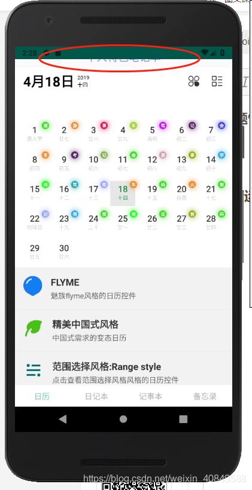

# Android App界面与顶部状态栏重叠遮盖问题


# Android App界面与顶部状态栏重叠遮盖问题

 问题情况截图如下：



觉得toolbar默认高度太高，给toolbar设了一个固定值。测试时发现在4.4系统上会出现与状态栏重叠的现象。给toolbar设了个margin，但是在7.0的系统上又会出现间隙。最后发现只需要在父view里加上下面两行就解决了。

android:clipToPadding="true"
android:fitsSystemWindows="true"

解释一下上面两个布局属性的意思：
android:clipToPadding 定义布局间是否有间距  

android:fitsSystemWindows="true" 意思就是设置应用布局时是否考虑系统窗口布局；如果为true，将调整系统窗口布局以适应你自定义的布局。比如系统有状态栏，应用也有状态栏时。实际就是通过在 View 上设置和系统窗口一样高度的边框（padding）来确保你的内容不会出现到系统窗口下面。

或只 在layout的主布局中加入 android:fitsSystemWindows="true" 
如下：

```xml
<LinearLayout xmlns:android="http://schemas.android.com/apk/res/android"
    xmlns:app="http://schemas.android.com/apk/res-auto"
    xmlns:tools="http://schemas.android.com/tools"
    android:layout_width="match_parent"
    android:layout_height="match_parent"
    android:orientation="vertical"
 
    android:fitsSystemWindows="true"
    tools:context=".MainActivity">
<!-- 布局内容...... -->
 
</LinearLayout>
```


