# Android Studio 修改项目名称和包名方法

# Android Studio 修改项目名称和包名方法

Android Studio修改项目名称和包名方法

平时项目开发中，有时候维护项目多，有的项目结构需要改变，这就需要我们去修改项目名称或者修改包名。下面介绍一下怎样修改项目名称和包名。

## 1. 修改项目名称

1）打开项目根目录下的`setting.gradle`文件，修改该文件中的`rootProject.name='新项目名'`；

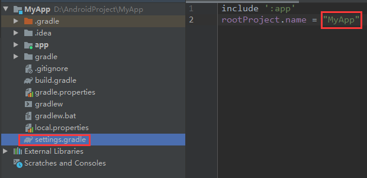

2）点击 **Sync Now** 重新编译项目；

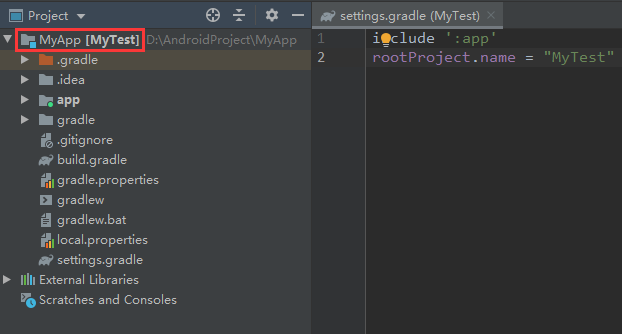

**★** 如果只是简单修改至此，会发现项目名称后依然备注着旧项目名，并没有彻底更换新的项目名。紧接着下面操作：

3）关闭 Android Studio；
 4）修改项目所在路径的文件名为新的项目名；
 5）打开AS，重新导入修改后的项目即可；

**★** 如果是 **AS 4.0之后** 的版本，修改至此就算修改完成；如果是 **AS 4.0之前** 的版本，会出现一些配置文件信息还是引用原来的项目名，并没有更换为新的项目名。紧接着下面操作：

6）找到项目根目录下的`xx.iml`文件，右键 **Refactor —— Rename** 打开修改编辑框；

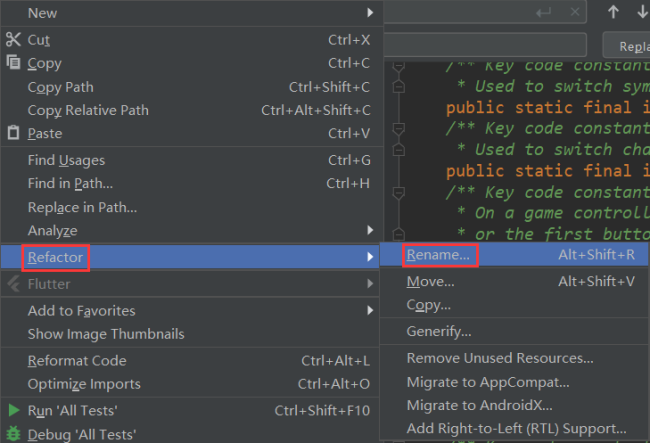

7）输入新的项目名，点击 **Refactor** 修改；

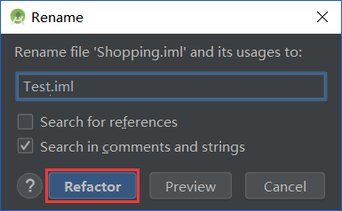

8）打开项目根目录下的`xx.iml`文件，修改该文件中的`project.id`字段：`external.linked.project.id="新项目名"`

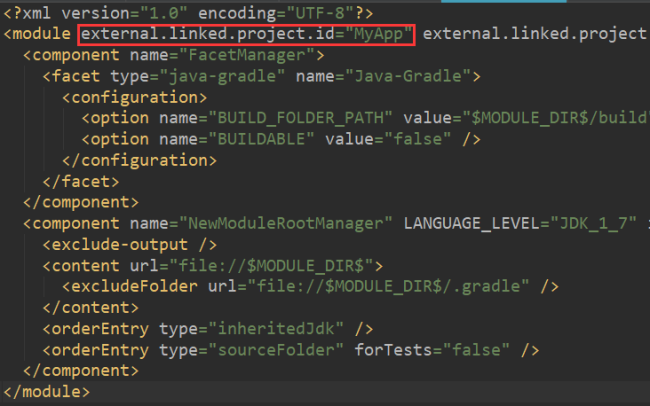

9）打开项目下`.idea/modules.xml`文件，修改该文件中的`fileurl`和`filepath`字段：`<module fileurl="file://$PROJECT_DIR$/新项目名.iml" filepath="$PROJECT_DIR$/新项目名.iml" />`

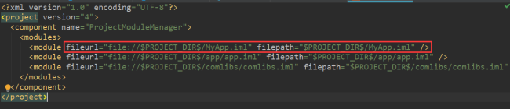

10）点击 **Rebuild Project** 重构项目，即可修改完成项目名称。

## 2. 修改项目包名

1）选中项目中药修改的包名；

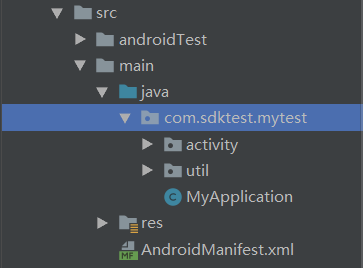

2）更改项目结构显示方式，取消 **Compact Middle Packages** 选项；

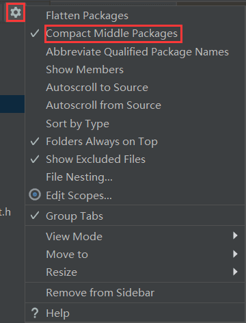

3）右键要修改的包名，选择 **Refactor —— Rename** 打开修改编辑框；

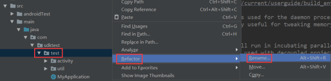

4）点击 **Rename package** 修改包名；

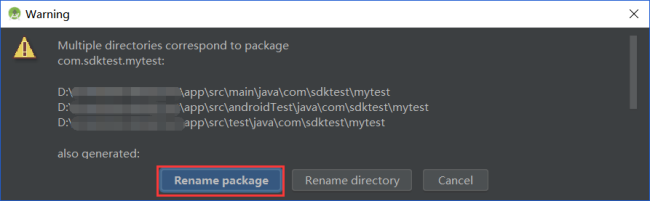

5）输入新的包名，点击 **Refactor** 修改；

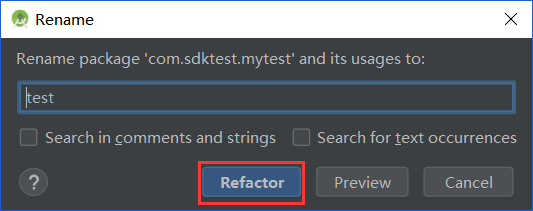

6）点击 **Do Refactor** 确定修改；

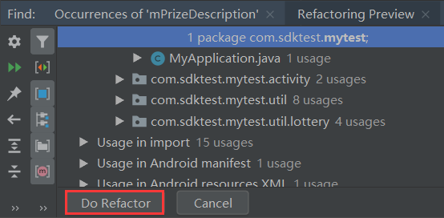

7）打开项目 **app/main** 目录下的`AndroidManifest.xml`文件，修改该文件中的`package="新包名"`字段；

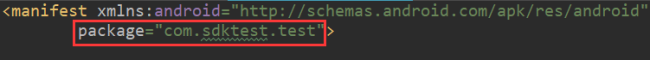

8）修改项目 **app** 下的 **build.gradle** 中的`applicationId "新包名"`字段；

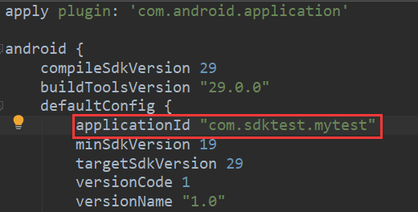

9）点击 **Sync Now** 同步，即可修改完成项目包名。

**注意：**
 修改完包名，项目出现错误无法运行，解决方法请移步 —— [《Android Studio修改包名导致引用R文件报错问题》](https://www.jianshu.com/p/03d20284366d)
