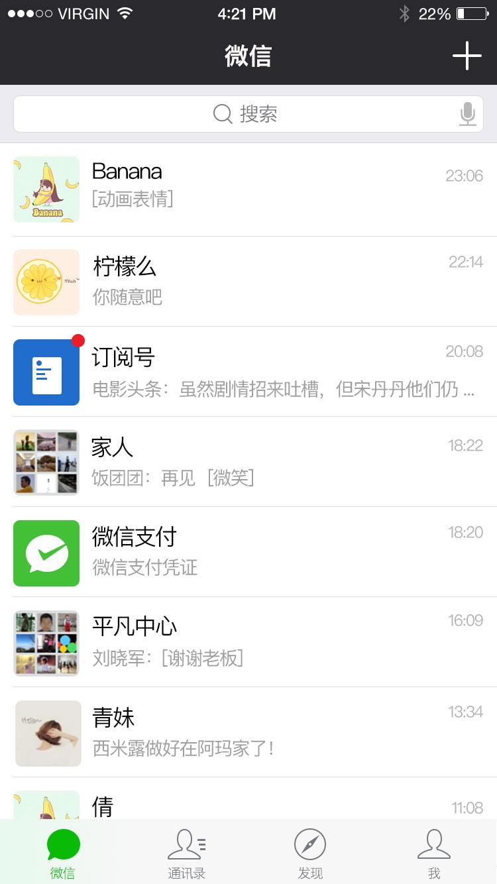
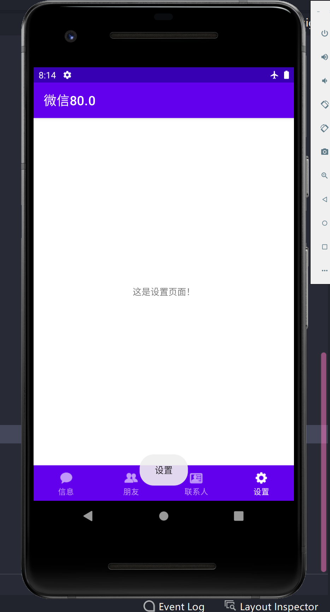

# 类微信界面设计


<!--more-->

# 类微信界面设计

使用Meterial_Design的BottomNavigationView组件构建底类似微信的四个底部导航栏的切换

## 1、原型图



顶部一个导航栏，，加号按钮的下拉菜单，下面是四个Tab页面，点击下方按钮，每个页面的上下两个导航栏之间的内容会随之发生变化，同时点击状态下的图标样式也随之变化。

## 2、需求

请根据课堂展示结果设计APP门户界面，包含4个tab切换效果。

## 3、思路

为了使用上课讲到的Material Design设计模式，我们分别使用了TopAppBar，一个ButtomNavigationMenu以及四个Fragment。同时采用了java语言作为点击按钮后界面内容的改变控制

## 4、代码

### 4.1、创建一个Empty项目

### 4.2、页面-activity_main.xml-四个界面的主（公共）组件

> 根据[官方文档](https://developer.android.google.cn/reference/com/google/android/material/bottomnavigation/LabelVisibilityMode)，导航栏有四种模式，auto、labeled、selected、unlabeled,对应关系如下

| 参数                |                             解释                             |
| ------------------- | :----------------------------------------------------------: |
| auto                | 当有3个或更少的项目时，标签的行为为“labeled”；当有4个或更多的项目时，标签的行为为“selected”。 |
| labeled             |                   标签显示在所有导航项目上                   |
| selected（default） |             标签显示在所选的导航项目上。（默认）             |
| unlabeled           |                 标签未显示在任何导航项目上。                 |

```xml
<?xml version="1.0" encoding="utf-8"?>
<androidx.constraintlayout.widget.ConstraintLayout xmlns:android="http://schemas.android.com/apk/res/android"
    xmlns:app="http://schemas.android.com/apk/res-auto"
    xmlns:tools="http://schemas.android.com/tools"
    android:layout_width="match_parent"
    android:layout_height="match_parent"
    android:visibility="visible"
    tools:context=".MainActivity">

    <LinearLayout
        android:id="@+id/linearLayout"
        android:layout_width="wrap_content"
        android:layout_height="wrap_content"
        android:orientation="vertical"
        app:layout_constraintBottom_toTopOf="@+id/bottom_navigation_menu"
        app:layout_constraintEnd_toEndOf="parent"
        app:layout_constraintStart_toStartOf="parent"
        app:layout_constraintTop_toTopOf="parent">
        <FrameLayout
            android:id="@+id/frameLayout"
            android:layout_width="match_parent"
            android:layout_height="match_parent">
        </FrameLayout>
    </LinearLayout>

    <com.google.android.material.bottomnavigation.BottomNavigationView
        android:id="@+id/bottom_navigation_menu"
        style="@style/Widget.MaterialComponents.BottomNavigationView.Colored"
        android:layout_width="match_parent"
        android:layout_height="wrap_content"
        app:labelVisibilityMode="labeled"
        app:layout_constraintBottom_toBottomOf="parent"
        app:layout_constraintEnd_toEndOf="parent"
        app:layout_constraintHorizontal_bias="1.0"
        app:layout_constraintStart_toStartOf="parent"
        app:menu="@menu/bottom_navigation_menu" />
</androidx.constraintlayout.widget.ConstraintLayout>
```

### 4.3、页面-fragment_ctt.xml-联系人组件（朋友、信息、设置都差不多，不再过多展示，GitHub源码地址在本文最后）

```xml
<?xml version="1.0" encoding="utf-8"?>
<FrameLayout xmlns:android="http://schemas.android.com/apk/res/android"
    xmlns:tools="http://schemas.android.com/tools"
    android:layout_width="match_parent"
    android:layout_height="match_parent"
    tools:context=".MesFragment">

    <TextView
        android:layout_width="wrap_content"
        android:layout_height="wrap_content"
        android:text="@string/cttText" />

</FrameLayout>
```

### 4.4、页面-bottom_navigation_menu.xml-底部导航栏组件

```xml
<?xml version="1.0" encoding="utf-8"?>
<menu xmlns:android="http://schemas.android.com/apk/res/android"
    xmlns:app="http://schemas.android.com/apk/res-auto">

    <item
        android:id="@+id/page_Mes"
        android:enabled="true"
        android:icon="@drawable/tab_weixin_normal"
        android:title="@string/message" />

    <item
        android:id="@+id/page_Fri"
        android:enabled="true"
        android:icon="@drawable/tab_find_frd_normal"
        android:title="@string/friends" />

    <item
        android:id="@+id/page_Ctt"
        android:enabled="true"
        android:icon="@drawable/tab_address_normal"
        android:title="@string/contacts" />

    <item
        android:id="@+id/page_Set"
        android:enabled="true"
        android:icon="@drawable/tab_settings_normal"
        android:title="@string/settings" />

</menu>
```

### 4.5、页面-color.xml-颜色配置文件

```xml
<?xml version="1.0" encoding="utf-8"?>
<resources>
    <color name="purple_200">#FFBB86FC</color>
    <color name="purple_500">#FF6200EE</color>
    <color name="purple_700">#FF3700B3</color>
    <color name="teal_200">#FF03DAC5</color>
    <color name="teal_700">#FF018786</color>
    <color name="black">#FF000000</color>
    <color name="white">#FFFFFFFF</color>
</resources>
```

### 4.6、页面-strings.xml-文字字符串配置文件

```xml
<resources>
    <!--    app标题-->
    <string name="app_name">微信80.0</string>
    <!--    导航栏标题-->
    <string name="message">信息</string>
    <string name="friends">朋友</string>
    <string name="contacts">联系人</string>
    <string name="settings">设置</string>
    <!--    界面二级标题-->
    <string name="mesText">这是信息页面！</string>
    <string name="friText">这是朋友页面！</string>
    <string name="cttText">这是联系人页面！</string>
    <string name="setText">这是设置页面！</string>
    <!-- TODO: Remove or change this placeholder text -->
    <string name="hello_blank_fragment">Hello blank fragment</string>
</resources>
```

### 4.7、页面-theme.xml-主题配置文件

```xml
<resources xmlns:tools="http://schemas.android.com/tools">
    <!-- Base application theme. -->
    <style name="Theme.Bottom_Navigation" parent="Theme.MaterialComponents.DayNight.DarkActionBar">
        <!-- Primary brand color. -->
        <item name="colorPrimary">@color/purple_500</item>
        <item name="colorPrimaryVariant">@color/purple_700</item>
        <item name="colorOnPrimary">@color/white</item>
        <!-- Secondary brand color. -->
        <item name="colorSecondary">@color/teal_200</item>
        <item name="colorSecondaryVariant">@color/teal_700</item>
        <item name="colorOnSecondary">@color/black</item>
        <!-- Status bar color. -->
        <item name="android:statusBarColor" tools:targetApi="l">?attr/colorPrimaryVariant</item>
        <!-- Customize your theme here. -->
    </style>
</resources>
```

### 4.8后台-MainActivity.java-控制逻辑代码

```java
package cn.edu.hubu.lhy.bottom_navigation;

import androidx.annotation.NonNull;
import androidx.appcompat.app.AppCompatActivity;
import androidx.fragment.app.Fragment;
import androidx.fragment.app.FragmentManager;
import androidx.fragment.app.FragmentTransaction;

import android.os.Bundle;
import android.view.Menu;
import android.view.MenuInflater;
import android.view.MenuItem;
import android.widget.Toast;

import com.google.android.material.bottomnavigation.BottomNavigationView;

public class MainActivity extends AppCompatActivity {

    private MesFragment mesFragment = null;
    private FriFragment friFragment = null;
    private CttFragment cttFragment = null;
    private SetFragment setFragment = null;

    @Override
    protected void onCreate(Bundle savedInstanceState) {
        super.onCreate(savedInstanceState);
        setContentView(R.layout.activity_main);

        BottomNavigationView bottom_navigation_menu = (BottomNavigationView) findViewById(R.id.bottom_navigation_menu);
        bottom_navigation_menu.setOnNavigationItemSelectedListener(mOnNavigationItemSelectedListener);
        mesFragment = new MesFragment();
        changeFrameLayout("您好", mesFragment);
    }

    private BottomNavigationView.OnNavigationItemSelectedListener mOnNavigationItemSelectedListener
            = new BottomNavigationView.OnNavigationItemSelectedListener() {

        @Override
        public boolean onNavigationItemSelected(@NonNull MenuItem item) {

            switch (item.getItemId()) {
                case R.id.page_Mes:
                    if (mesFragment == null) {
                        mesFragment = new MesFragment();
                    }
                    changeFrameLayout("信息", mesFragment);
                    return true;
                case R.id.page_Fri:
                    if (friFragment == null) {
                        friFragment = new FriFragment();
                    }
                    changeFrameLayout("朋友", friFragment);
                    return true;
                case R.id.page_Ctt:
                    if (cttFragment == null) {
                        cttFragment = new CttFragment();
                    }
                    changeFrameLayout("联系人", cttFragment);
                    return true;
                case R.id.page_Set:
                    if (setFragment == null) {
                        setFragment = new SetFragment();
                    }
                    changeFrameLayout("设置", setFragment);
                    return true;
            }
            return false;
        }
    };

    /**
     * 使用Fragment组件替换原界面上的FragLayout
     *
     * @param string   提示信息
     * @param fraGment 要替换成的fragment
     */
    private void changeFrameLayout(String string, Fragment fraGment) {
        //弹窗
        Toast.makeText(MainActivity.this, string, Toast.LENGTH_SHORT).show();
        //每一次都要重新创建事务和管理工具
        FragmentManager fagmentManager = getSupportFragmentManager();
        FragmentTransaction fragmentTransaction = fagmentManager.beginTransaction();
        //替换操作
        fragmentTransaction.replace(R.id.frameLayout, fraGment);
        //事务具有原子性，类似数据库，每一次操作完成需要提交操作
        fragmentTransaction.commit();
    }
}
```

### 4.9、后台-CttFragment.java-联系人组件代码

> 创建Fragment自动生成的构造方法、newInstance()、onCreate()方法啊需要禁掉不然会产生一些问题

```java
package cn.edu.hubu.lhy.bottom_navigation;

import android.os.Bundle;
import android.view.LayoutInflater;
import android.view.View;
import android.view.ViewGroup;

import androidx.fragment.app.Fragment;

/**
 * A simple {@link Fragment} subclass.
 * Use the {@link FriFragment#newInstance} factory method to
 * create an instance of this fragment.
 */
public class FriFragment extends Fragment {

    @Override
    public View onCreateView(LayoutInflater inflater, ViewGroup container,
                             Bundle savedInstanceState) {
        // Inflate the layout for this fragment
        return inflater.inflate(R.layout.fragment_fri, container, false);
    }
}
```

## 5、最终效果

### 5.1、信息页面


### 5.2、朋友界面


### 5.3、联系人界面


### 5.4、设置界面



## 6、Github源码

https://github.com/KKKPJSKEY/Weixin_Meterial_Design
