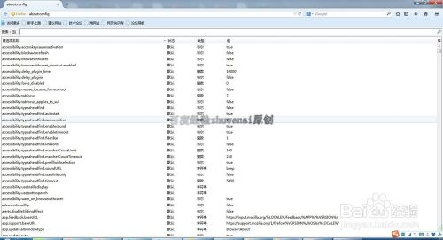

# 火狐浏览器禁用js

# 火狐浏览器禁用js

首先打开火狐浏览器

接着再地址栏输入**about:config，**点击**回车键**

接着看到如下画面。去掉**下次任显示此警告**前面的方框里的**钩，**再点击**我 保证会小心按钮**

点击后看到如下画面，在搜索地址栏中输入**javascript.enabled**

接着就会看到如下图，原来有很多的内容变成之后两个了。

鼠标右键第一个，弹出菜单。再点击**切换**

当一行的中的，值由trun变成false。时候说明已经关闭了。

如下图只要打开有javascript，页面就会无法使用了。有些页面还会提示。

