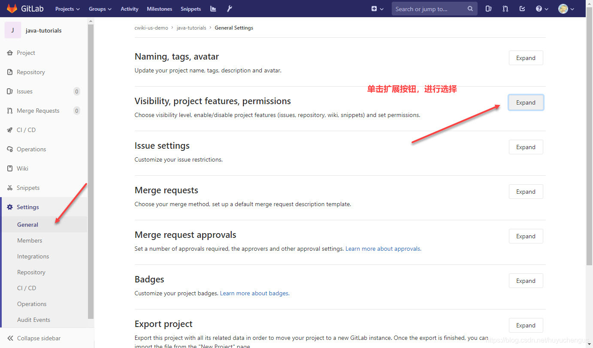
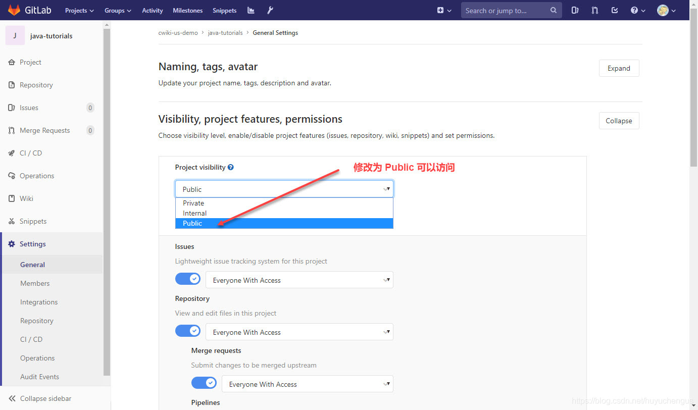
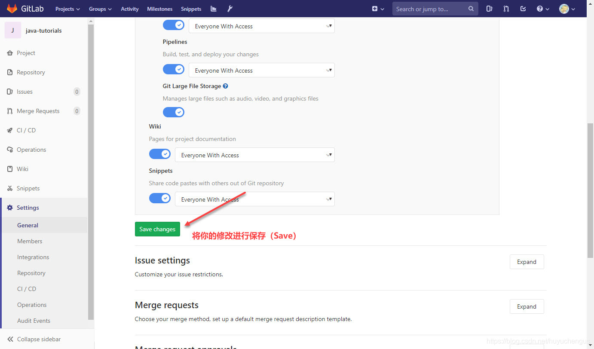

# GitLab（私服）修改仓库可见性

# GitLab（私服）修改仓库可见性

在 UI 界面中，选择 Settings > General。

在弹出的界面中，选择 Visibility, project features, permissions 后面的 Expand 按钮。

然后在弹出的界面中，将 Project Visibility 下面从 Private 选择为 Public。

你的项目就可以被 Public 访问到了。

最后，不要忘记将你的修改保存以便于生效。
