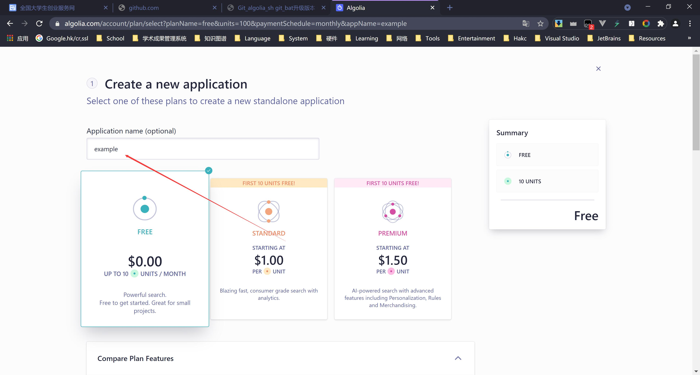
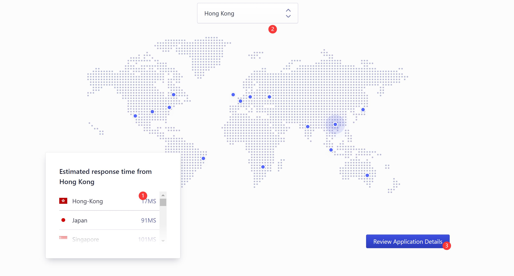
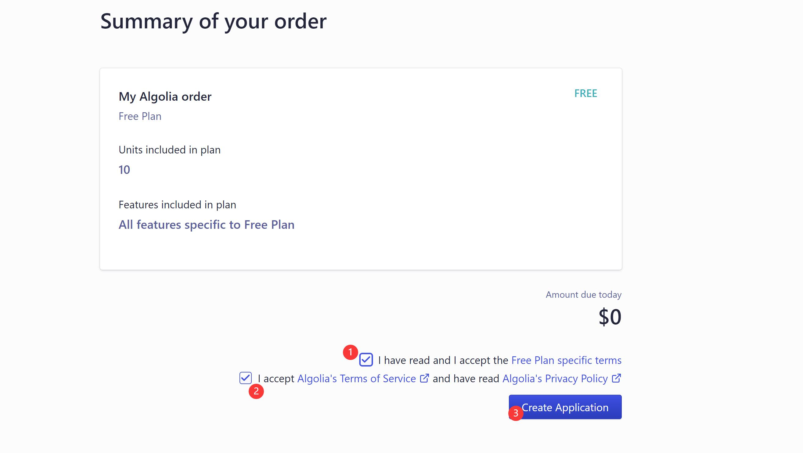
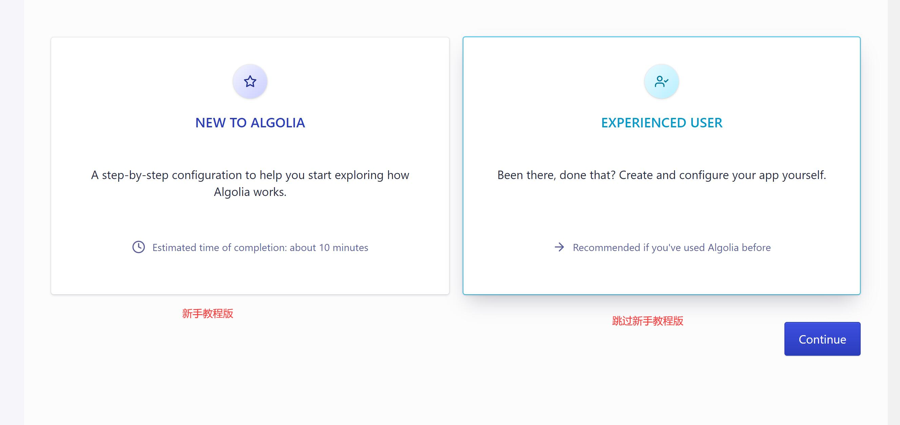
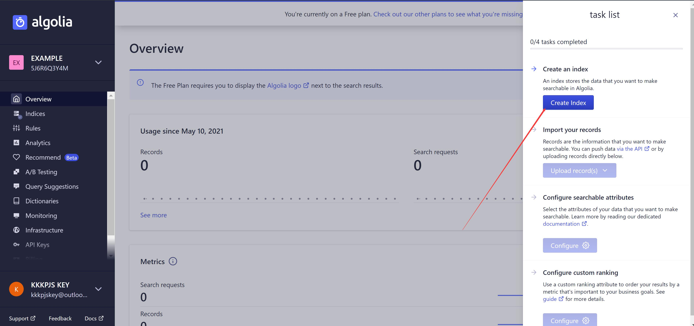
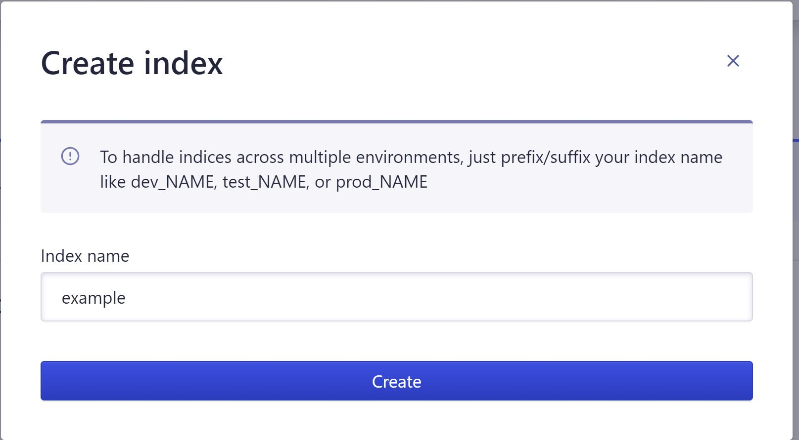
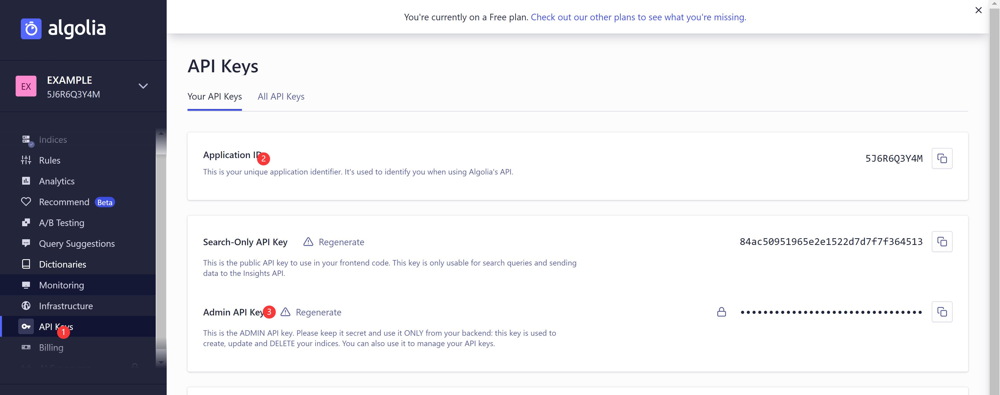
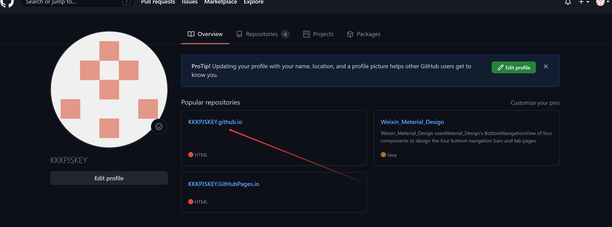
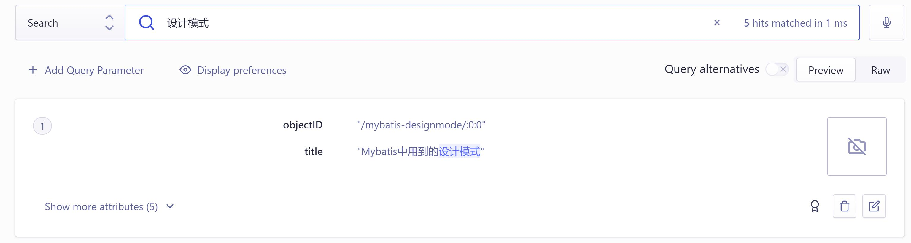

# Hogo配置Algolia


# Hogo配置Algolia

<!--more-->

## 1 config.toml 配置

首先我们配置好 config.toml 的 algolia 的配置，以中文配置作为示例

```toml
      [languages.zh-cn.params.search]
        enable = true
        # 搜索引擎的类型 ("lunr", "algolia")
        type = "algolia"
        # 文章内容最长索引长度
        contentLength = 4000
        # 搜索框的占位提示语
        placeholder = ""
        # 最大结果数目
        maxResultLength = 10
        # 结果内容片段长度
        snippetLength = 50
        # 搜索结果中高亮部分的 HTML 标签
        highlightTag = "em"
        # 是否在搜索索引中使用基于 baseURL 的绝对路径
        absoluteURL = false
        [languages.zh-cn.params.search.algolia]
          index = "KKKPJSKEY's-Case-Archives"
          appID = "algolia.com.API Keys.Application ID"
          searchKey = "algolia.com.API Keys.Admin API Key"
```

## 2 Algolia 配置

### 2.1 登录 [Algolia 官网](https://www.algolia.com/) ，注册账号，创建 Application 名为 “example”作为举例，默认选择 “FREE” 即可，这里自定义名称




### 2.2 我这里选择香港作为存储地区

1. 查看自己的网速
2. 选择网速较快的地区
3. 点击下一步



1. 勾选
2. 勾选
3. 点击创建



我就跳过新手教程了



### 2.3 创建index，要与config.toml 的配置 index 一样





### 2.4 将 API Keys 里面补充到 config.toml 里面（见2.1）



## 3 使用 [atomic-algolia](https://github.com/chrisdmacrae/atomic-algolia) 来完成自动更新索引

### 3.1 首先安装 npm，这里不介绍

### 3.2 安装 atomic-algolia（在任意目录下）

```shell
npm -g install atomic-algolia --save
```

### 3.3 创建 .env 文件存放 algolia 配置（在网站根目录下）

```env
ALGOLIA_APP_ID="algolia.com.API Keys.Application ID"
ALGOLIA_ADMIN_KEY="algolia.com.API Keys.Admin API Key"
ALGOLIA_INDEX_NAME="example"
ALGOLIA_INDEX_FILE="public/index.json"
```

### 3.4 修改网站根目录下的 `package.json` 文件（没有就新建），在 `scripts` 下添加 `"algolia": "atomic-algolia"`

```json
{
  "scripts": {
    "test": "echo \"Error: no test specified\" && exit 1",
    "algolia": "atomic-algolia"
  }
}

```

### 3.5 上传索引的命令 你可以本地执行 `npm run algolia` 查看运行效果

## 4 .1定制化脚本

```shell
#!/bin/sh

# If a command fails then the deploy stops
set -e

start_local_hugo_server(){
	hugo server --disableFastRender
}

update_algolia(){

	pwd	
	npm run algolia
	printf "\033[0;32m已经更新到 algolia ！！！\033[0m\n"
	sleep 10
}

pushMyBlogHugo(){
	printf "\033[0;32mDeploying updates to GitHub "https://github.com/KKKPJSKEY/KKKPJSKEY.github.io"\033[0m\n"
	git pull
	# Add changes to git.
	git add .

	# Commit changes.
	msg="change MyBlogHugo site $(date)"

	if [ "$#" -gt 1 ]; then
		msg="$2"
	fi
	git commit -m "$msg"

	# Push source and build repos.
	git push origin master
	sleep 10
}

push_public(){
	printf "\033[0;32mDeploying updates to GitHub "https://github.com/KKKPJSKEY/KKKPJSKEY.github.io"\033[0m\n"
		# Build the project.
	hugo  # if using a theme, replace with `hugo -t <YOURTHEME>`

	# Go To Public folder
	cd public
	pwd
	git pull
	# Add changes to git.
	git add .
	
	# Commit changes.
	msg="rebuilding site $(date)"

	if [  "$#" -gt 1 ]; then
		msg="$2"
	fi

	git commit -m "$msg"

	# Push source and build repos.
	git push 

	sleep 10
}

case $1 in
	1)
		start_local_hugo_server
    ;;
	2)
		pushMyBlogHugo	$*	
    ;;
    3)
		push_public $*		
    ;;
	4)
		update_algolia		
    ;;
	5)
		hugo serve -e production
	;;
	6)
		hugo server --source=themes/LoveIt/exampleSite
	;;
esac

```

脚本解析：

> sh deploy.sh 1：启动 hugo 作为本地调试使用，实时将文章的内容更新到站点，不需要重启也能边修改边观看效果。
>
> sh deploy.sh 2：将 MyHugoBlog 上传到 Github 存储库。
>
> sh deploy.sh 3：将 public 静态文件站点上传到Github Pages 存储库。
>
> sh deploy.sh 4：更新 algolia 的索引.
>
> sh deploy.sh 5：主要是用来调试 cdn，评论系统等，所以要用 production 变量来启动。
>
> sh deploy.sh 6：查看官方例子，方便调试。

## 4 .2我的脚本

> 分析可知仅上传流程中需要两步顺序操作，其他调试普通指令一步基本可以解决，故略去其他脚本，仅使用生成索引并上传，将GitHub Pages上传至Github仓库两步操作脚本

update.sh

```sh
#!/bin/sh

# If a command fails then the deploy stops
set -e

update_algolia(){

	pwd	
	npm run algolia
	printf "\033[0;32m已经更新到 algolia ！！！\033[0m\n"
	sleep 10
}

push_public(){
	printf "\033[0;32mDeploying updates to GitHub "https://github.com/KKKPJSKEY/KKKPJSKEY.github.io/"\033[0m\n"
		# Build the project.
	hugo  # if using a theme, replace with `hugo -t <YOURTHEME>`

	# Go To Public folder
	cd public
	pwd
	git pull origin master
	# Add changes to git.
	git add .
	
	# Commit changes.
	msg="rebuilding site $(date)"

	#param num > 1
	if [  "$#" -gt 1 ]; then
		printf "参数个数错误,只能传一个参数为提交的信息！"
		exit 0
	else
		git commit -m "$1"

		# Push source and build repos.
		git push origin master
	fi
}

update_algolia
push_public $*
```


## 5结果

仓库代码检验：



 algolia 的索引:


