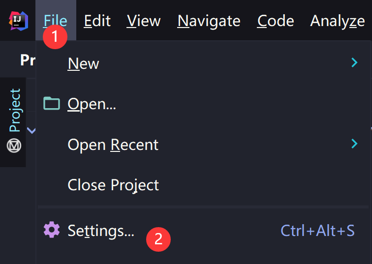
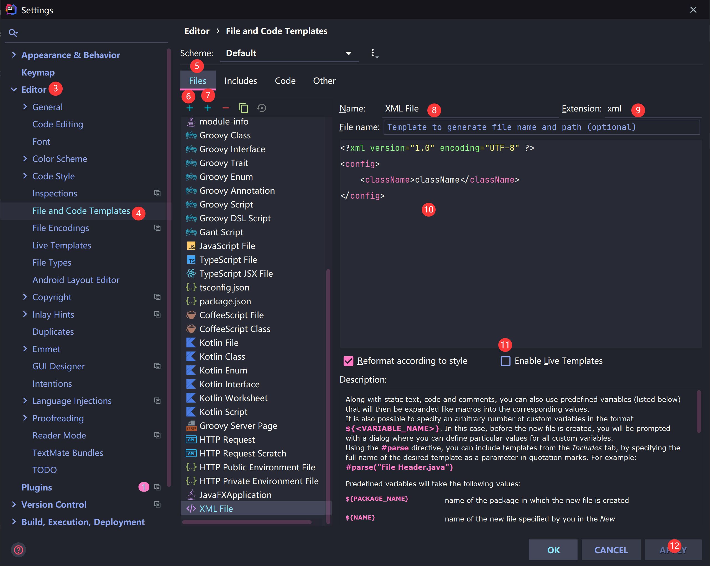
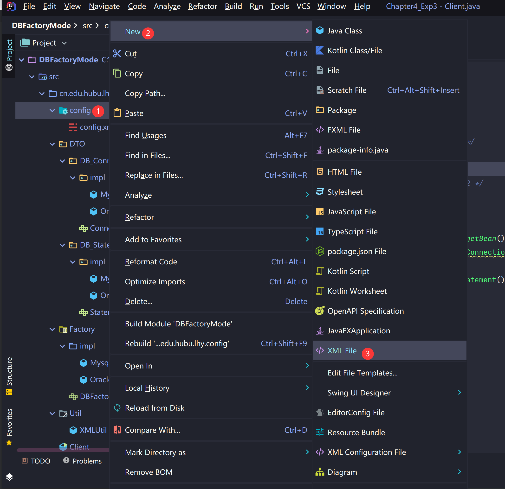

# Idea创建xml文件


# Idea创建xml文件



1、File---->Settings



2、Editor(3)---->File And Code Templates(4) —>中间选中Files(5) ----->点击左边+号(6)，右边是建立子模版（7），添加模板 ----->输入模板名字：Name:XML File.xml （8，name可以自定义） ------>后缀名extension：xml （9）—>在面板中间输入内容（10，内容请根据自己需求更改，或建立子模版）：

```xml
<?xml version="1.0" encoding="UTF-8" ?> 
<config>
	<className>className</className>
</config>
```

----->把enable live Template(激活模板)勾选上（11） ------>点击Apply（12）—ok



3、选中文件夹（1）----->New（2）-------->找到XML File（3），输入名字，点击确定，就可以创建xml文件了


