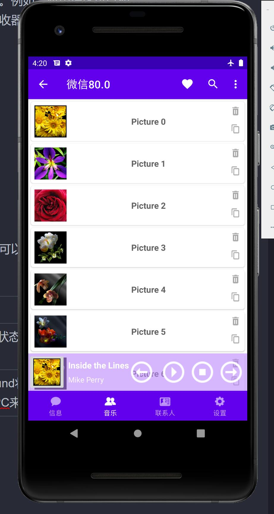
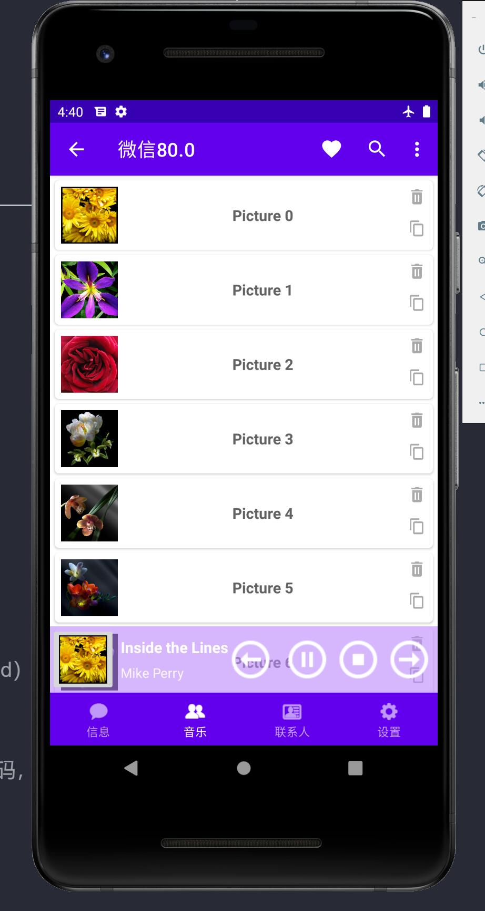

# 基于广播和服务功能的音乐播放器


# 基于广播和服务功能的音乐播放器

## 1、应用知识点

### 1.1、Android 广播接收器(Broadcast Receivers)

广播接收器用于响应来自其他应用程序或者系统的广播消息。这些消息有时被称为事件或者意图。例如，应用程序可以初始化广播来让其他的应用程序知道一些数据已经被下载到设备，并可以为他们所用。这样广播接收器可以定义适当的动作来拦截这些通信。

有以下两个重要的步骤来使系统的广播意图配合广播接收器工作。

- 创建广播接收器
- 注册广播接收器

还有一个附加的步骤，要实现自定义的意图，你必须创建并广播这些意图。

### 1.2、服务（Service）

服务是一个后台运行的组件，执行长时间运行且不需要用户交互的任务。即使应用被销毁也依然可以工作。服务基本上包含两种状态 

| 状态    | 描述                                                         |
| :------ | :----------------------------------------------------------- |
| Started | Android的应用程序组件，如活动，通过startService()启动了服务，则服务是Started状态。一旦启动，服务可以在后台无限期运行，即使启动它的组件已经被销毁。 |
| Bound   | 当Android的应用程序组件通过bindService()绑定了服务，则服务是Bound状态。Bound状态的服务提供了一个客户服务器接口来允许组件与服务进行交互，如发送请求，获取结果，甚至通过IPC来进行跨进程通信。 |

## 2、原型图



老师要求的原型图仅包括四个按钮和两个文本。

四个按钮分别为上一曲、播放暂停、停止、下一曲；两个文本为曲名和歌手。

我在老师要求的基础上，结合上次实验RecyclerView进行更新，目的如图所示，实现一个类似常规音乐播放器的界面。

左侧包括歌曲的图片，上方时每首歌的列表。

## 2、需求

编写音乐盒代码，参考群文件-源码-Musicbox，掌握源码后在其基础上添加音乐播放的 上一首 和 下一首 控制，也可以增加更多的功能。

## 3、思路

在真正的代码撰写中，广播就是内嵌于activity和service的。在界面中绘制四个按钮、一个图片和两个文本，填入数据。监听不同按钮点击事件，绑定对应的广播函数或服务。

## 4、代码

### 4.1、fragment_mes.xml（在原基础上添加即可）

```xml
<androidx.constraintlayout.widget.ConstraintLayout
        android:id="@+id/constraintLayout_mes_mp"
        android:layout_width="match_parent"
        android:layout_height="70dp"
        android:layout_gravity="bottom"
        android:background="#99BB86FC"
        android:orientation="horizontal">


        <ImageButton
            android:id="@+id/iB_ablum"
            android:layout_width="70dp"
            android:layout_height="wrap_content"
            android:scaleType="centerCrop"
            android:src="@drawable/flower1"
            app:layout_constraintBottom_toBottomOf="parent"
            app:layout_constraintEnd_toEndOf="parent"
            app:layout_constraintHorizontal_bias="0.0"
            app:layout_constraintStart_toStartOf="parent"
            app:layout_constraintTop_toTopOf="parent"
            app:layout_constraintVertical_bias="0.0" />

        <TextView
            android:id="@+id/tV_musicName"
            android:layout_width="wrap_content"
            android:layout_height="wrap_content"
            android:layout_marginStart="5dp"
            android:layout_marginBottom="15dp"
            android:text="Inside the Lines"
            android:textColor="#FFFFFFFF"
            android:textSize="16sp"
            android:textStyle="bold"
            app:layout_constraintBottom_toBottomOf="parent"
            app:layout_constraintStart_toEndOf="@+id/iB_ablum"
            app:layout_constraintTop_toTopOf="parent"
            app:layout_constraintVertical_bias="0.333" />

        <TextView
            android:id="@+id/tV_singerName"
            android:layout_width="wrap_content"
            android:layout_height="wrap_content"
            android:layout_marginStart="5dp"
            android:layout_marginBottom="5dp"
            android:text="Mike Perry"
            android:textColor="#DDFFFFFF"
            android:textSize="14sp"
            app:layout_constraintBottom_toBottomOf="parent"
            app:layout_constraintStart_toEndOf="@+id/iB_ablum"
            app:layout_constraintTop_toBottomOf="@+id/tV_musicName" />

        <ImageButton
            android:id="@+id/iB_lastPiece"
            android:layout_width="60dp"
            android:layout_height="60dp"
            android:background="#00BB86FC"
            android:src="@drawable/arrow_left_thin_circle_outline"
            app:layout_constraintBottom_toBottomOf="parent"
            app:layout_constraintEnd_toStartOf="@+id/iB_playPause"
            app:layout_constraintTop_toTopOf="parent" />

        <ImageButton
            android:id="@+id/iB_playPause"
            android:layout_width="60dp"
            android:layout_height="60dp"
            android:background="#00BB86FC"
            android:src="@drawable/arrow_right_drop_circle_outline"
            app:layout_constraintBottom_toBottomOf="parent"
            app:layout_constraintEnd_toStartOf="@+id/iB_stop"
            app:layout_constraintTop_toTopOf="parent" />

        <ImageButton
            android:id="@+id/iB_stop"
            android:layout_width="wrap_content"
            android:layout_height="wrap_content"
            android:background="#00BB86FC"
            android:src="@drawable/stop_circle_outline"
            app:layout_constraintBottom_toBottomOf="@+id/iB_lastPiece"
            app:layout_constraintEnd_toStartOf="@+id/iB_nextPlay"
            app:layout_constraintTop_toTopOf="@+id/iB_lastPiece" />

        <ImageButton
            android:id="@+id/iB_nextPlay"
            android:layout_width="60dp"
            android:layout_height="60dp"
            android:background="#00BB86FC"
            android:src="@drawable/arrow_right_thin_circle_outline"
            app:layout_constraintBottom_toBottomOf="parent"
            app:layout_constraintEnd_toEndOf="parent"
            app:layout_constraintTop_toTopOf="parent" />

    </androidx.constraintlayout.widget.ConstraintLayout>
```

### 4.2、MesFragment.java（仅展示在原来recyclerView之后的内容）

```java
public class MesFragment extends Fragment implements View.OnClickListener {
    // 获取界面中显示歌曲标题、作者文本框
    TextView title, author;
    // 播放/暂停、停止按钮、上一曲按钮，下一曲按钮
    ImageButton play, stop, next, last;

    ActivityReceiver activityReceiver;

    public static final String CTL_ACTION =
            "org.xr.action.CTL_ACTION";
    public static final String UPDATE_ACTION =
            "org.xr.action.UPDATE_ACTION";
    // 定义音乐的播放状态，0x11代表没有播放；0x12代表正在播放；0x13代表暂停
    int status = 0x11;
    String[] titleStrs = new String[]{"Inside the Lines", "Landslide", "Life", "Symphony", "The Spectre"};
    String[] authorStrs = new String[]{"Mike Perry", "Headhunterz", "Tobu", "Clean Bandit", "Alan Walker"};
        // 获取程序界面界面中的两个按钮
        play = (ImageButton) view.findViewById(R.id.iB_playPause);
        stop = (ImageButton) view.findViewById(R.id.iB_stop);
        title = (TextView) view.findViewById(R.id.tV_musicName);
        author = (TextView) view.findViewById(R.id.tV_singerName);

        //获取上一首、下一首按钮
        last = (ImageButton) view.findViewById(R.id.iB_lastPiece);
        next = (ImageButton) view.findViewById(R.id.iB_nextPlay);

        // 为两个按钮的单击事件添加监听器
        play.setOnClickListener(this);
        stop.setOnClickListener(this);
        //为上一首、下一首按钮添加监听器
        last.setOnClickListener(this);
        next.setOnClickListener(this);


        activityReceiver = new ActivityReceiver();
        // 创建IntentFilter
        IntentFilter filter = new IntentFilter();
        // 指定BroadcastReceiver监听的Action
        filter.addAction(UPDATE_ACTION);
        // 注册BroadcastReceiver

        getActivity().registerReceiver(activityReceiver, filter);

        Intent intent = new Intent(getActivity(), MusicService.class);
        // 启动后台Service
        getActivity().startService(intent);

        return view;


    }

    // 自定义的BroadcastReceiver，负责监听从Service传回来的广播
    public class ActivityReceiver extends BroadcastReceiver {
        @Override
        public void onReceive(Context context, Intent intent) {
            // 获取Intent中的update消息，update代表播放状态
            int update = intent.getIntExtra("update", -1);
            // 获取Intent中的current消息，current代表当前正在播放的歌曲
            int current = intent.getIntExtra("current", -1);
            if (current >= 0) {
                title.setText(titleStrs[current]);
                author.setText(authorStrs[current]);
            }


            switch (update) {
                case 0x11:
                    play.setImageResource(R.drawable.arrow_right_drop_circle_outline);
                    status = 0x11;
                    break;
                //控制系统进入播放状态
                case 0x12:
                    // 播放状态下设置使用暂停图标
                    play.setImageResource(R.drawable.pause_circle_outline);
                    // 设置当前状态
                    status = 0x12;
                    break;
                // 控制系统进入暂停状态
                case 0x13:
                    // 暂停状态下设置使用播放图标
                    play.setImageResource(R.drawable.arrow_right_drop_circle_outline);
                    // 设置当前状态
                    status = 0x13;
                    break;
            }
        }
    }

    @Override
    public void onClick(View source) {
        // 创建Intent
        Intent intent = new Intent("org.xr.action.CTL_ACTION");
        switch (source.getId()) {
            // 按下播放/暂停按钮
            case R.id.iB_playPause:
                intent.putExtra("control", 1);
                break;
//            // 按下停止按钮
            case R.id.iB_stop:
                intent.putExtra("control", 2);
                break;
            // 按下上一曲按钮
            case R.id.iB_lastPiece:
                intent.putExtra("control", 3);
                break;
            // 按下下一曲按钮
            case R.id.iB_nextPlay:
                intent.putExtra("control", 4);
                break;
        }
        // 发送广播，将被Service组件中的BroadcastReceiver接收到
        getActivity().sendBroadcast(intent);
    }
}
```

### 4.3、MusicService.java（播放音乐服务）

```java
public class MusicService extends Service {
    MyReceiver serviceReceiver;
    AssetManager am;
    String[] musics = new String[]{"insidethelines.mp3", "landslide.mp3", "life.mp3", "symphony.mp3", "thespectre.mp3"};
//        String[] musics = new String[] {"liangliang.mp3", "wuhangya.mp3","three.mp3" ,"four.mp3","fif.mp3"};
    MediaPlayer mPlayer;
    // 当前的状态，0x11代表没有播放；0x12代表正在播放；0x13代表暂停
    int status = 0x11;
    // 记录当前正在播放的音乐
    int current = 0;

    @Override
    public IBinder onBind(Intent intent) {
        return null;
    }

    @Override
    public void onCreate() {
        super.onCreate();
        am = getAssets();
        // 创建BroadcastReceiver
        serviceReceiver = new MyReceiver();
        // 创建IntentFilter
        IntentFilter filter = new IntentFilter();
        filter.addAction(MesFragment.CTL_ACTION);
        registerReceiver(serviceReceiver, filter);


        // 创建MediaPlayer
        mPlayer = new MediaPlayer();
        // 为MediaPlayer播放完成事件绑定监听器
        mPlayer.setOnCompletionListener(new OnCompletionListener() // ①
        {
            @Override
            public void onCompletion(MediaPlayer mp) {
                current++;
                if (current >= 5) {
                    current = 0;
                }
                //发送广播通知Activity更改文本框
                Intent sendIntent = new Intent(MesFragment.UPDATE_ACTION);
                sendIntent.putExtra("current", current);
                // 发送广播，将被Activity组件中的BroadcastReceiver接收到
                sendBroadcast(sendIntent);
                // 准备并播放音乐
                prepareAndPlay(musics[current]);
            }
        });
    }

    public class MyReceiver extends BroadcastReceiver {
        @Override
        public void onReceive(final Context context, Intent intent) {
            int control = intent.getIntExtra("control", -1);
            switch (control) {
                // 播放或暂停
                case 1:
                    // 原来处于没有播放状态
                    if (status == 0x11) {
                        // 准备并播放音乐
                        prepareAndPlay(musics[current]);
                        status = 0x12;
                    }
                    // 原来处于播放状态
                    else if (status == 0x12) {
                        // 暂停
                        mPlayer.pause();
                        // 改变为暂停状态
                        status = 0x13;
                    }
                    // 原来处于暂停状态
                    else if (status == 0x13) {
                        // 播放
                        mPlayer.start();
                        // 改变状态
                        status = 0x12;
                    }
                    break;
//			 停止声音
                case 2:
                    // 如果原来正在播放或暂停
                    if (status == 0x12 || status == 0x13) {
                        // 停止播放
                        current++;
                        mPlayer.stop();
                        status = 0x11;
                    }
                case 3:
                    current--;
                    if (current < 0) {
                        current = 4;
                    }

                    if (status == 0x11 || status == 0x13) {
                        prepareAndPlay(musics[current]);
                        mPlayer.stop();
                        status = 0x11;
                    } else {
                        prepareAndPlay(musics[current]);
                        status = 0x12;
                    }
                    break;
                case 4:

                    current++;

                    if (current > 4) {
                        current = 0;
                    }

                    if (status == 0x11 || status == 0x13) {
                        prepareAndPlay(musics[current]);
                        mPlayer.stop();
                        status = 0x11;
                    } else {
                        prepareAndPlay(musics[current]);
                        status = 0x12;
                    }
                    break;
            }
            // 广播通知Activity更改图标、文本框
            Intent sendIntent = new Intent(MesFragment.UPDATE_ACTION);
            sendIntent.putExtra("update", status);
            sendIntent.putExtra("current", current);
            // 发送广播，将被Activity组件中的BroadcastReceiver接收到
            sendBroadcast(sendIntent);
        }
    }

    private void prepareAndPlay(String music) {
        try {
            // 打开指定音乐文件
            AssetFileDescriptor afd = am.openFd(music);
            mPlayer.reset();
            // 使用MediaPlayer加载指定的声音文件。
            mPlayer.setDataSource(afd.getFileDescriptor(),
                    afd.getStartOffset(), afd.getLength());
            // 准备声音
            mPlayer.prepare();
            // 播放
            mPlayer.start();
        } catch (IOException e) {
            e.printStackTrace();
        }
    }
}
```


## 5、最终效果

### 5.1、初始状态，暂停未进行播放


### 5.2、点击播放按钮，按钮变为等待暂停状态，音乐播放



### 5.3、点击上一曲按钮，保存当前状态（播放或暂停）切换到上一曲


### 5.4、点击下一曲按钮，保存当前状态（播放或暂停）切换到下一曲


### 5.5、点击暂停则停止播放，点击继续则从刚才的位置继续播放，点击停止按钮停止播放


## 6、结语

本次实验感想颇多，在不同的学习渠道，加上百度搜索，请教同学最终仅仅完成了一个初步的成果。后续需要改进和维护的东西还有很多很多。音乐的图标需要更换，切换歌曲应该随之切换图片，recyclerView的数据并没有与歌曲一同绑定。本人水平一般，能力有限，精力也有限，随着时间的推移慢慢完善吧。

## 7、Github源码

https://github.com/KKKPJSKEY/Weixin_Meterial_Design

注：

> 源码中为了实现某些功能，减少大面积重命名文件的情况，信息和朋友页面进行对调（id），朋友改为音乐（title和icon），请读者注意！
>
> 在下次实验完成前，master分支和本次实验分支（Music_Box）会有一样的本次实验代码，下次实验完成后会新创建分支，保存新实验的代码啊，更新master分支代码


