# 主题文档 - 内置 Shortcodes


**Hugo** 提供了多个内置的 Shortcodes, 以方便作者保持 Markdown 内容的整洁.

<!--more-->

Hugo 使用 Markdown 为其简单的内容格式. 但是, Markdown 在很多方面都无法很好地支持. 你可以使用纯 HTML 来扩展可能性.

但这恰好是一个坏主意. 大家使用 Markdown, 正是因为它即使不经过渲染也可以轻松阅读. 应该尽可能避免使用 HTML 以保持内容简洁.

为了避免这种限制, Hugo 创建了 [shortcodes](https://gohugo.io/extras/shortcodes/).
shortcode 是一个简单代码段, 可以生成合理的 HTML 代码, 并且符合 Markdown 的设计哲学.

Hugo 附带了一组预定义的 shortcodes, 它们实现了一些非常常见的用法.
提供这些 shortcodes 是为了方便保持你的 Markdown 内容简洁.

## 1 figure {#figure}

[`figure` 的文档](https://gohugo.io/content-management/shortcodes#figure)

一个 `figure` 示例:

```markdown

```

呈现的输出效果如下:



输出的 HTML 看起来像这样:

```html
<figure>
  
  <figcaption>
    <h4>Lighthouse (figure)</h4>
  </figcaption>
</figure>
```

## 2 gist

[`gist` 的文档](https://gohugo.io/content-management/shortcodes#gist)

一个 `gist` 示例:

```markdown

```

呈现的输出效果如下:



输出的 HTML 看起来像这样:

```html
<script
  type="application/javascript"
  src="https://gist.github.com/spf13/7896402.js"
></script>
```

## 3 highlight

[`highlight` 的文档](https://gohugo.io/content-management/shortcodes#instagram)

一个 `highlight` 示例:

```markdown


<section id="main">
    <div>
        <h1 id="title">{{ .Title }}</h1>
        {{ range .Pages }}
            {{ .Render "summary"}}
        {{ end }}
    </div>
</section>

```

呈现的输出效果如下:



<section id="main">
    <div>
        <h1 id="title">{{ .Title }}</h1>
        {{ range .Pages }}
            {{ .Render "summary"}}
        {{ end }}
    </div>
</section>


## 4.1 instagram(旧版)

[`instagram` 的文档](https://gohugo.io/content-management/shortcodes#instagram) [instagram官方文档（Facebook）](https://developers.facebook.com/docs/instagram/oembed-legacy/)

一个 `instagram` 示例:

```markdown

```

呈现的输出效果如下:

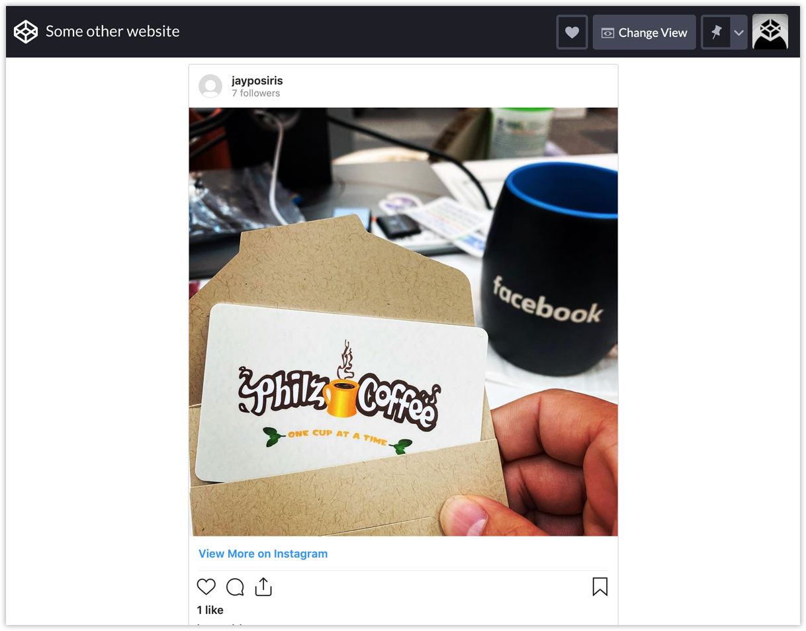

此功能被丢弃更换为新版方式获取

## 4.2 instagram(新版)

[`instagram` 的文档（Hugo官方未更新）](https://gohugo.io/content-management/shortcodes#instagram) [instagram官方文档（Fackbook）](https://developers.facebook.com/docs/instagram/oembed)

```shell
#1.在开发者官方注册
#在开发者工具中创建任务获取app-id和app-secret，填入下面的请求地址
curl -X GET "https://graph.facebook.com/oauth/access_token ?client_id={your-app-id} &client_secret={your-app-secret} &grant_type=client_credentials"
# 示例
curl -X GET "https://graph.facebook.com/oauth/access_token ?client_id=123&client_secret={456} &grant_type=client_credentials"
#获得token后填入下面的地址，即可获得返回的html代码
curl -X GET \ 'https://graph.facebook.com/v10.0/instagram_oembed?url={url}&access_token={access-token}"
# 示例
curl -X GET \ 'https://graph.facebook.com/v10.0/instagram_oembed?url=https://www.instagram.com/p/fA9uwTtkSN/&access_token=IGQVJ..."
```

总结如下，新版无法进行直接内嵌完成，需要完成以下步骤（两种方式均可）参考前端大佬js获取的方式

[Instagram oEmbed 嵌入 IG 貼文](https://www.letswrite.tw/instagram-embed/)

[Facebook：应用程式、ID、密钥、URL](https://letswrite.tw/firebase-auth-google-fb/#facebook：應用程式、id、密鑰、url)

4.2.1直接使用手机客户端应用打开，找到对应的文章，点击三点，再点击内嵌即可生成对应的访问地址

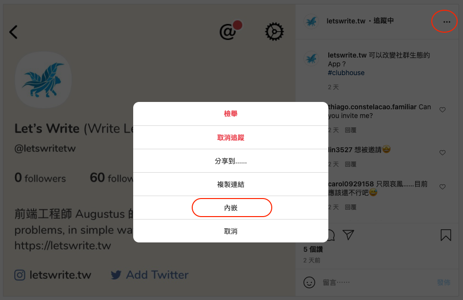

4.2.2使用代码方式步骤

1. 到Facebook for Developers上建立一个应用程序，取得编号、密钥

   要在Firebase 开启Facebook 登入功能，需要有一组Facebook 应用程式的ID、密钥。

   > 本篇建立的应用程式是示范用，本篇上线时就会删除，因此应用程式编号、密钥都会不存在。

   进到[FACEBOOK for Developers](https://developers.facebook.com/apps/)的页面并登入FB帐号后，点击「建立应用程式」：

   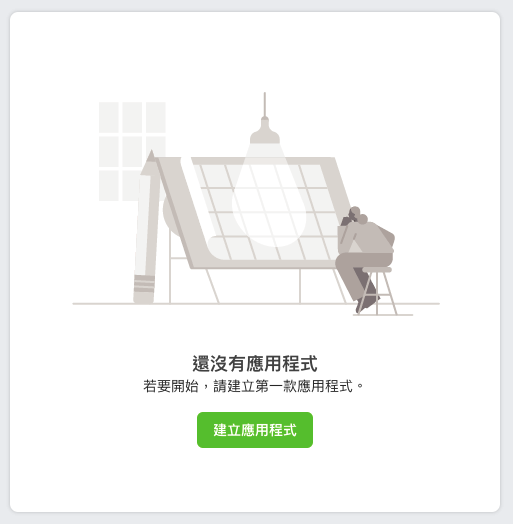

   工作的部份选「更多选项」：

   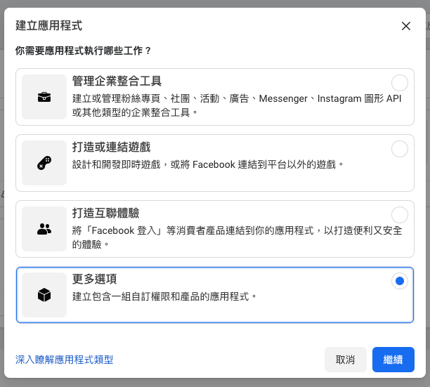

   下一个是要填写应用程式的显示名称，就填一个我们看得懂在做什么的名称：

   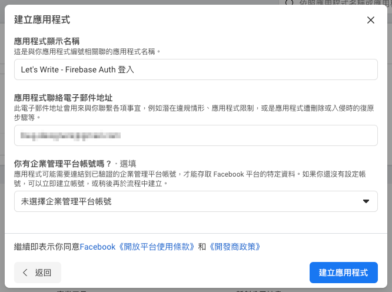

   填完后按下「建立应用程式」，就会建立完成。

   ### 应用程式编号、密钥、OAuth URL

   应用程式建立完，进到应用程式，左侧选单点击「设定> 基本资料」，就会看到「应用程式编号」、「应用程式密钥」，以及一些需要填写的栏位：

   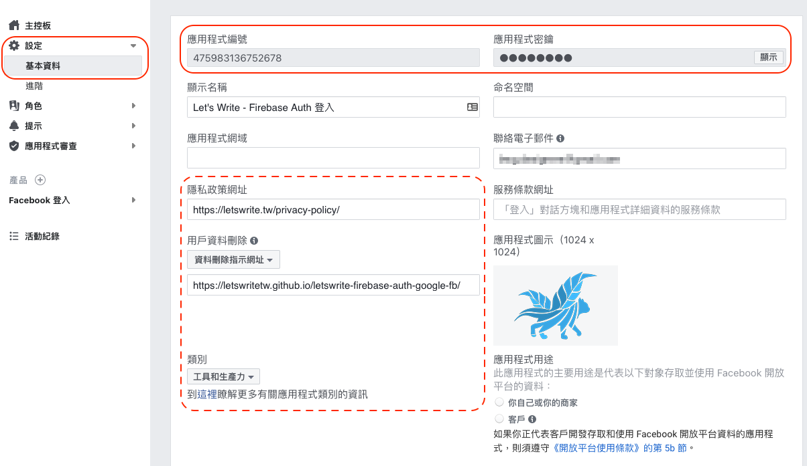

2. 应用程序上新增产品：oEmbed，并把应用程序调整成「上线」

   ## 新增产品：oEmbed

   应用程式建立完成后，左侧选单点击「产品」旁边的「+」：

   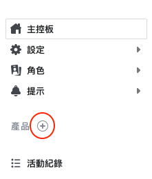

   然后找到「oEmbed」这项，点击「设定」：

   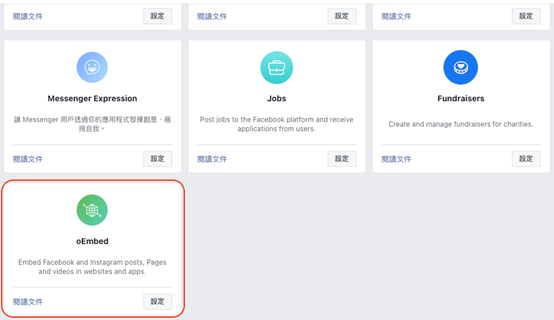

   会跳一个确认框，打勾后按下「确认」，左侧的产品清单就会新增oEmbed，代表新增成功。

   最后顶部那条有一个显示为「调整中」的Toggle 按钮：

   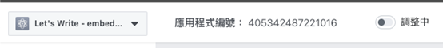

   我们点一下按钮，并确认要切换模式，让它变成「上线」，这个应用程式就可以对外使用了：

   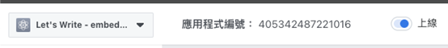

3. 在Google云端硬盘上新增Google Apps Script的档案，档案中写取得Access Token的代码

   ## 新增GAS 档案当后端，取得FB Access Token

   为了要能够使用FB 的应用程式，必须要有一个Access Token 才能够被FB 放行，因为取Token 的过程会用到密钥，因此要写在后端，写在前端会被看光光。

   最快写一支后端的方式就是用Google 云端硬碟里的Google Apps Script 档案，以下简称GAS。

   进到Google 云端硬碟，点左上角的「新增> 更多> Google Apps Script」：

   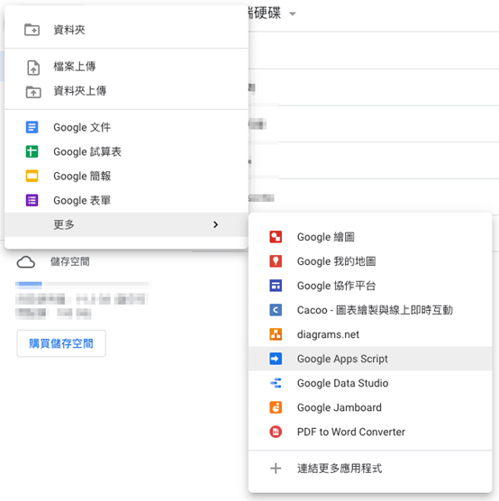

   进到档案后，我们先改个档名进行存档，滑到左上角的档案名称上，点击一次就可以开始改档名

   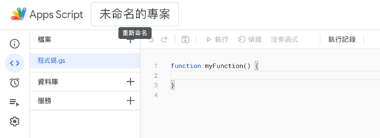

   右侧预设会有一个`myFunction`，整个删掉后，贴上以下程式码，主要是来取得Access Token的：

   ```javascript
   var  appId  =  '从FB后台取得的「应用程式编号」' ;
   var  secret  =  '从FB后台取得的「应用程式密钥」' ;
   
   
   var  uri  =  'https://graph.facebook.com/oauth/access_token?client_id='  +  appId  +  '&client_secret='  +  secret  +  '&grant_type=client_credentials' ;
   
   
   function  doGet ( e )  {
     var  response  =  UrlFetchApp . fetch ( uri ) ;
     return  ContentService . createTextOutput ( response ) . setMimeType ( ContentService . MimeType . JSON ) ;
   }
   ```

   `appId`、`secret`这二个变数记得要修改。

   `doGet`指的是当这个GAS预到`GET`时要执行哪些动作，function里面写的是向FB取得Access Token。

   程式码贴上并更新好变数后，按下右上角的「部署> 新增部署作业」：

   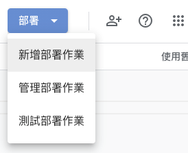

   点击「选取类型」右边的齿轮icon，选择「网页应用程式」：

   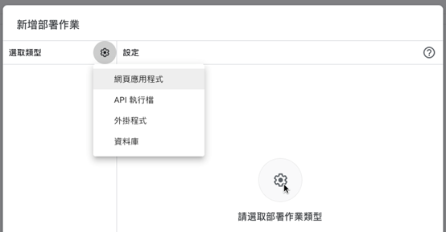

   接着右侧「谁可以存取」的地方改为所有人：

   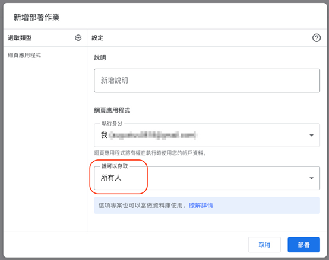

   按下「部署」后，第一次部署会需要开存取权：

   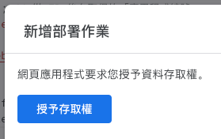

   点击上图的「授予存取权」后，会出现一个警告视窗：

   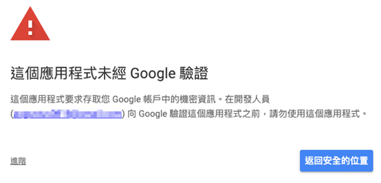

   因为这个应用程式是我们自己写的，是可以相信的，点击上图左上角的「进阶」后，会展开一小行字：

   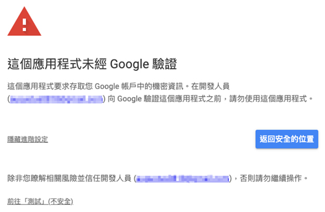

   点击上图左下角的「前往XXX（不安全）」，因为我们的应用程式没向Google 请求验证过，这边就会一直秀出不安全的字样。

   点击了以后会要授予存取权：

   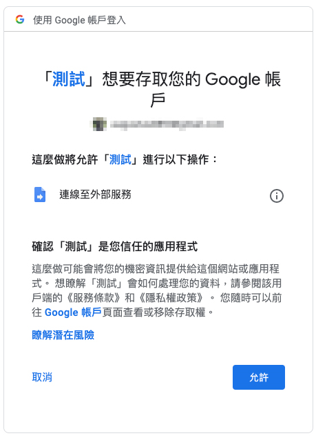

   按下「允许」，这个GAS 档就成功部署，并且会给一串网址：

   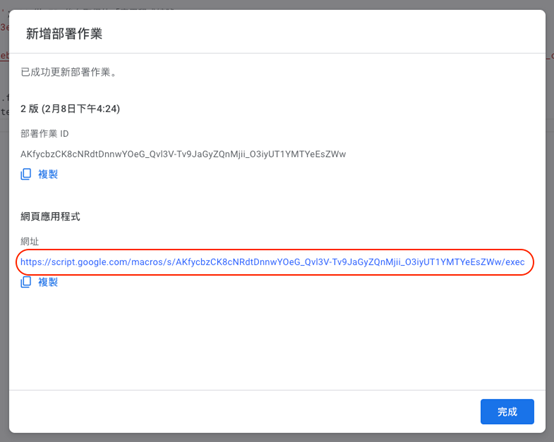

   这个网址很重要，就像API一样，`GET`这个网址，就会回传一组Access Token回来。

4. 用JavaScript、Postman、浏览器等取Access Token，并用Access Token取得Instagram贴文的嵌入代码

   ## 取Token、取IG 贴文

   在上一步的最后我们取得了部署的网址，首先我们先用`GET`取得Access Token回来：

   ```javascript
   const  getToken  =  '部署完取得的网址' ;
   fetch ( getToken )
     . then ( response  =>  response . json ( ) )
     . then ( response  =>  {
       console . log ( response ) ;
     } )
   ```

   Console 出来的response 资料会像这样：

   ```
   {
     access_token: "405342487221016|50nqwaePxasUkpNVyIwrJpoA2H0",
     token_type: "bearer"
   }
   ```

   所以我们可以知道，`response.access_token`就是我们要的Access Token。

   接下来就是拿这个Access Token 去取得IG 的贴文内容。

   首先我们要先有IG 贴文的网址，在贴文上面点右上角的点点点，在点击「复制连结」，就取到贴文的网址了：

   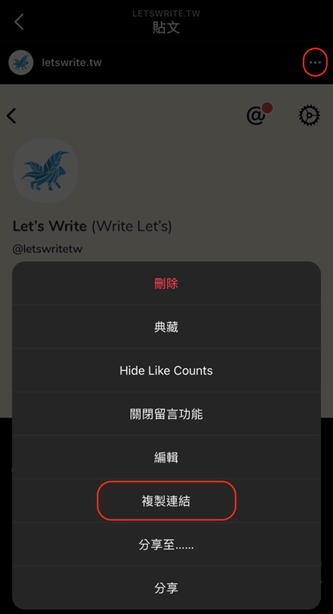

   有了贴文的网址，也有了Token，我们可以用一个`GET`来取得贴文的资讯：

   ```javascript
   const  getToken  =  '部署完取得的网址' ;
   const  igUri  =  'IG贴文的网址' ;
   const  hideCaption  =  true ;  //要不要隐藏描述，true隐藏、false不隐藏
       
   fetch ( getToken )
     . then ( response  =>  response . json ( ) )
     . then ( response  =>  response . access_token )
     . then ( token  =>  {
       fetch ( `https://graph.facebook.com/v9.0/instagram_oembed?url= ${ igUri } &access_token= ${ token } &hidecaption= ${ hideCaption } ` )
         . then ( response  =>  response . json ( ) )
         . then ( response  =>  {
           console . log ( response ) ;
         } )
       } ) ;
   ```

   从API 的URL 上可以看到，需要的参数有：IG 贴文网址、Access Token，跟hidecaption 是否要隐藏描述。

   hidecaption 没有写在新的文件里，神奇的是却有写在旧文件里，这是Augustus 看了前一篇的文章后试出来的，所以如果哪天FB 把这参数拿掉也不用意外。

   另外，复制出的IG 贴文网址本身会带一个参数，像这样：

   ```
   https://www.instagram.com/p/CK6wSwfpuVi/?igshid=1wy9n8xgtbe89
   ```

   实测后，有没有写到igshid 这个参数都没关系，都抓得到贴文资料回来。

   除了上面三个参数，还有二个参数是[官方文件](https://developers.facebook.com/docs/instagram/oembed)有提供的：`maxwidth`、`omitscript`。

   `maxwidth` 是可以指定嵌入贴文时的最大宽度。

   `omitscript`是Boolean值，预设为`false`，一般来说我们在嵌入IG贴文时，IG会自动把贴文的资料载入，如果我们想要有另外执行载入贴文的需求，这边就可以写`true`，之后再执行：`instgrm.Embeds.process()`就可以把贴文载进页面中。

   But！实作时，不确定是不是Augustus有写错，不论`omitscript`是`true`或`false`，如果没执行`instgrm.Embeds.process()`那贴文就会是呈现白白的样子，像这样：

   

   而且旧的方法吐回来的html，里面会自行引用IG 的embed.js，新的看起来是跟FB 整并所以就没有了，要自行引用：

   ```
   <script src="https://www.instagram.com/embed.js"></script>
   ```

   console 出来的response 会长这样：

   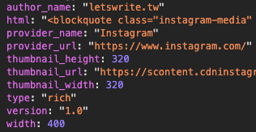

   可以看到的值有：

   ```
   author_name
   html
   provider_name
   provider_url
   thumbnail_height
   thumbnail_url
   thumbnail_width
   type
   version
   width
   ```

   其中`html`就是我们要嵌入IG贴文的程式码，整段放到我们要放的地方就行，这篇的Demo是放在`<div id="ig-iframe"></div>`这个div中。

   完整嵌入IG 贴文的程式码如下：

   ```html
   < div  id =" ig-iframe " > </ div >
     
   < script  src =" https://www.instagram.com/embed.js " > </ script >
   < script >
     const  getToken  =  '部署完取得的网址' ;
     const  igUri  =  'IG贴文的网址' ;
     const  hideCaption  =  true ;  //选填，要不要隐藏描述，true隐藏、false不隐藏，预设为false
     const  maxWidth  =  400 ;  //选填，贴文的最大宽度是多少
   
   
     fetch ( getToken )
       . then ( res  =>  res . json ( ) )
       . then ( res  =>  {
         const  token  =  res . access_token ;
         fetch ( `https://graph.facebook.com/v9.0/instagram_oembed?url= ${ igUri } &access_token= ${ token } &hidecaption= ${ hideCaption } &maxwidth= ${ maxWidth } ` )
           . then ( res  =>  res . json ( ) )
           . then ( res  =>  {
             const  wrap  =  document . getElementById ( 'ig-iframe' ) ;
             wrap . insertAdjacentHTML ( 'afterbegin' ,  res . html ) ;
             instgrm . Embeds . process ( ) ;
           } ) . catch ( err  =>  {
             throw  Error ( e )
           } )
         } ) . catch ( err  =>  {
           throw  Error ( e )
         } ) ;
   </ script >
   ```

   完成的IG 贴文嵌入就完成啦~

   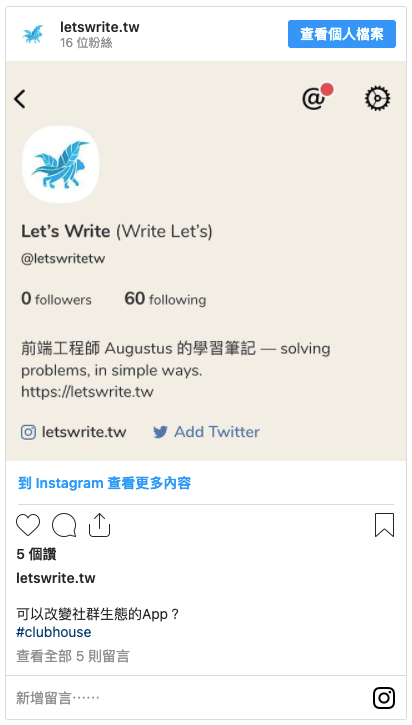

如此两种方式并不能简洁快速的嵌入instagram，需要同一般资源一样进行嵌入，Hugo官方暂时并未做出修改适配，若已经适配请联系我。

## 5 param

[`param` 的文档](https://gohugo.io/content-management/shortcodes#param)

一个 `param` 示例:

```markdown

```

呈现的输出效果如下:



## 6 ref 和 relref {#ref-and-relref}

[`ref` 和 `relref` 的文档](https://gohugo.io/content-management/shortcodes#ref-and-relref)

## 7 tweet

[`tweet` 的文档](https://gohugo.io/content-management/shortcodes#tweet)

一个 `tweet` 示例:

```markdown

```

呈现的输出效果如下:


## 8 vimeo

[`vimeo` 的文档](https://gohugo.io/content-management/shortcodes#vimeo)

一个 `vimeo` 示例:

```markdown

```

呈现的输出效果如下:



## 9 youtube

[`youtube` 的文档](https://gohugo.io/content-management/shortcodes#youtube)

一个 `youtube` 示例:

```markdown

```

呈现的输出效果如下:


