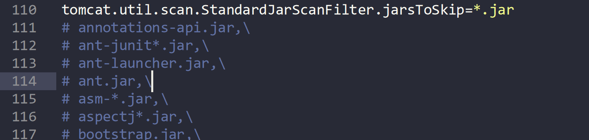
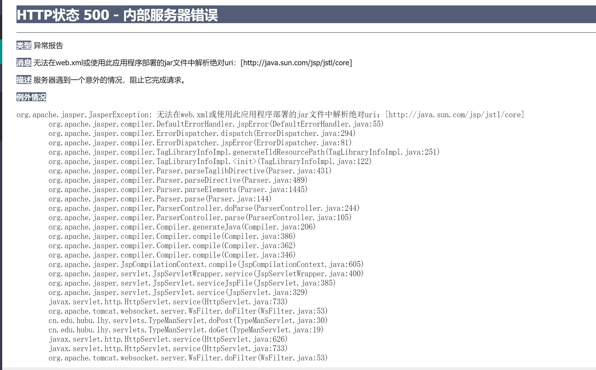
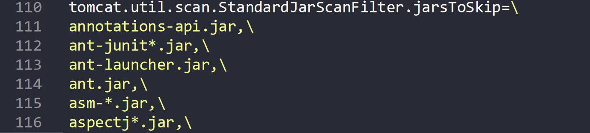

# Tomcat部署Jstl项目报错

# Tomcat部署Jstl项目报错

## 问题来源

原Tomcat启动有一条警告，由于看着不爽就查了办法去掉了

办法是修改Tomcat根目录下的conf文件夹下的catalina.properties文件（我这个版本的Tomcat大概在110行）

apache-tomcat-9.0.41\conf\catalina.properties

改成如下图的样子，报错就消失了

改的时候还很年轻，并不知道自己改了什么，觉得还不错，于是天坑就挖好了

## 翻车

后面跟着老师开发jsp的时候使用了jstl，然后就死活报错

四处百度无果，向老师求助，老师怀疑是未正确导包，加上我正使用最新版idea，没有j2ee创建web项目了，只能创建普通项目，进入后在添加web模块，加深了老师怀疑导包问题。

期间曾将tld文件直接解压出来使用，被老师喊停，并劝我用maven，我于是转普通j2ee项目为Maven的Web项目，结果肯定问题没解决。

后有尝试创建普通Maven项目，再加入Web组件，依然没解决。

后由于课程时间有限，老师放弃了我。

不甘心，只能解压出tld文件直接使用，熬夜追赶任务进度

## 解决

项目部署时，同学没有服务器，委托我进行部署，巧妙的发现同学的项目在我这也有问题，将我的代码发给同学，同学可以运行。同时发现部署在服务器上没有任何问题，故深刻怀疑Tomcat的问题。

经过这个思路的稍作搜索，下载了新的tomcat，发现警告，想起了我对Tomcat配置文件下手的事情，所以恢复修改

系统顺利运行！！！问题终于解决。鬼问题纠结了我许久
