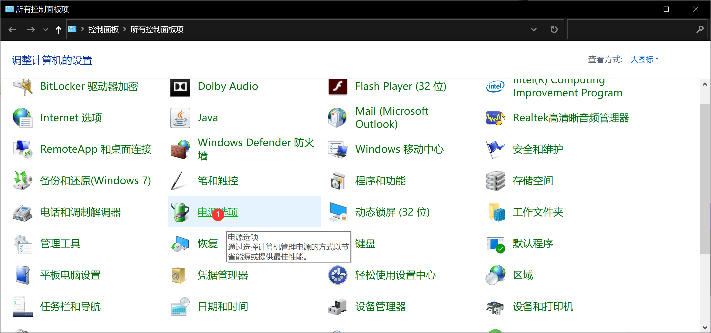
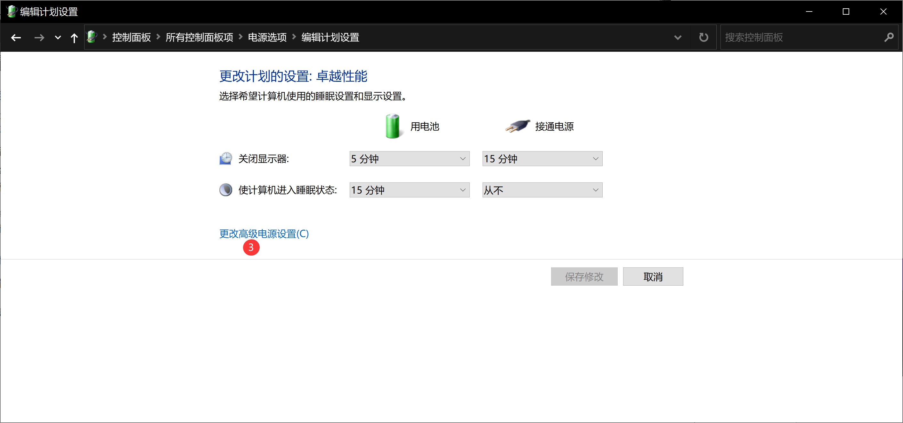
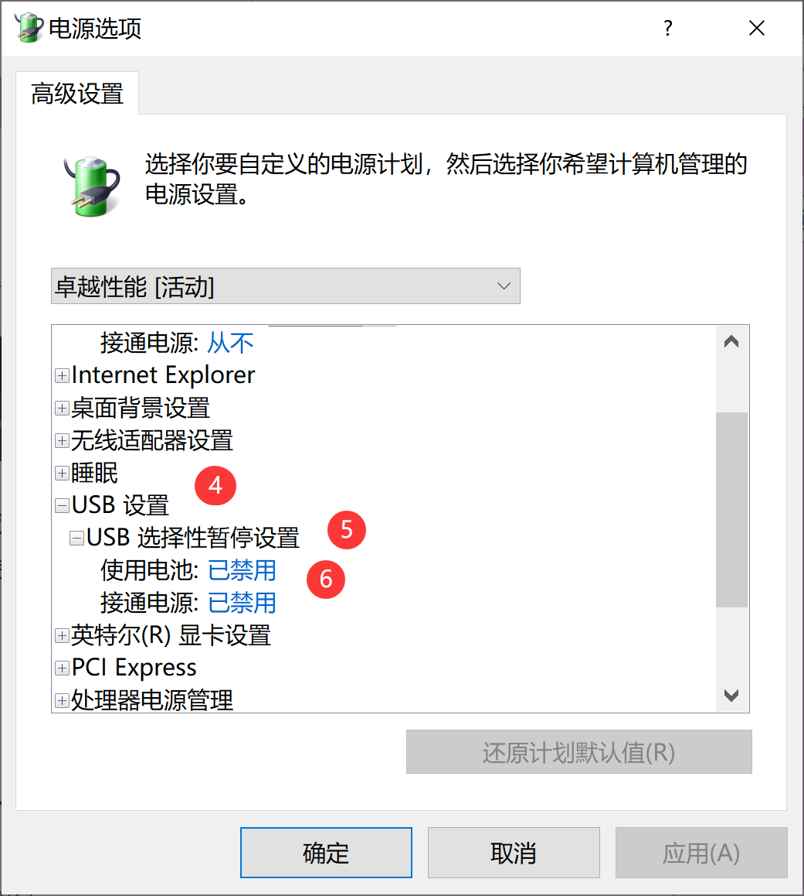

# Win10鼠标出现延迟现象

# Win10鼠标出现延迟现象

## 1、修改控制面板电源选项

控制面板下的电源选项

找到自己当前的电源计划，点击更改计划设置

点击更改高级电源设置

在Usb设置下的USB选择性暂停设置下的使用电池和接通电源均禁用（该操作可能耗电，情况有点好转，但鼠标还是不灵敏）

## 2、由于连接在扩展坞上，切换至USB无此情况，怀疑扩展坞问题，更换扩展坞情况有点好转，但鼠标还是不灵敏）

## 3、随着Win10 更新，原扩展坞和鼠标延迟现象彻底消失，最新版的Win10还是有Bug的

